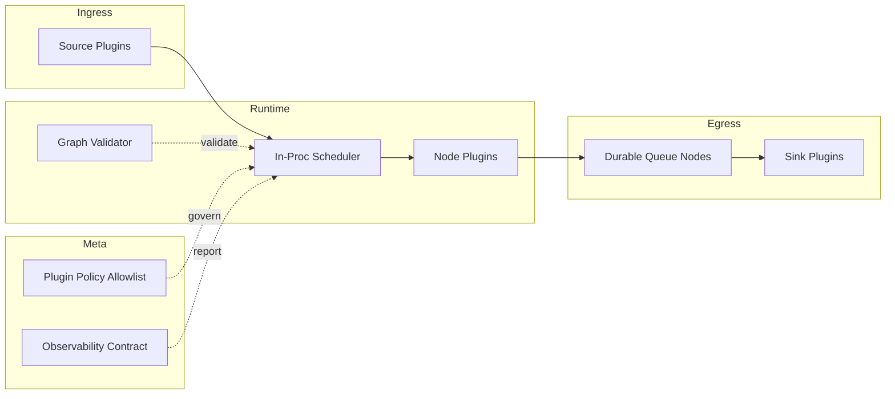
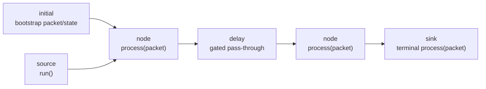
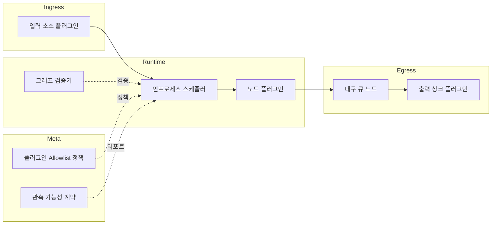
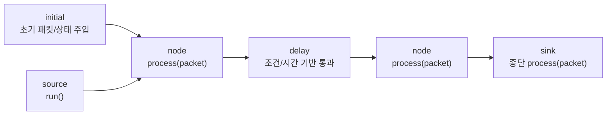

# schnitzel-stream-platform


> Edge-first universal stream processing platform
> 엣지 우선 범용 스트림 플랫폼

Stable entrypoint (SSOT): `python -m schnitzel_stream`

---

## English

### Overview

`schnitzel-stream-platform` is a v2 node-graph runtime for stream processing.

Current focus:
- portable node graph execution (`version: 2`)
- strict graph validation (topology + compatibility)
- plugin-based IO/policy nodes
- durable queue primitives (SQLite/WAL)
- edge-oriented ops conventions
- CLI is graph-native only

### Architecture



### Quickstart

1. Install

```bash
pip install -r requirements.txt
```

2. Environment

```powershell
# Windows
./setup_env.ps1
```

```bash
# Linux/macOS
export PYTHONPATH=src
```

3. Environment doctor

```bash
python scripts/env_doctor.py
python scripts/env_doctor.py --strict --json
python scripts/env_doctor.py --profile yolo --json
python scripts/env_doctor.py --profile webcam --probe-webcam --camera-index 0
```

4. Validate

```bash
python -m schnitzel_stream validate
```

5. Run default v2 graph

```bash
python -m schnitzel_stream
```

6. Useful demo graphs

```bash
python -m schnitzel_stream --graph configs/graphs/dev_inproc_demo_v2.yaml
python -m schnitzel_stream --graph configs/graphs/dev_durable_enqueue_v2.yaml
python -m schnitzel_stream --graph configs/graphs/dev_durable_drain_ack_v2.yaml
python -m schnitzel_stream --graph configs/graphs/dev_rtsp_frames_v2.yaml
python -m schnitzel_stream --graph configs/graphs/dev_webcam_frames_v2.yaml
python -m schnitzel_stream --graph configs/graphs/dev_video_file_yolo_overlay_v2.yaml
python -m schnitzel_stream --graph configs/graphs/dev_http_event_sink_v2.yaml
python -m schnitzel_stream --graph configs/graphs/dev_jsonl_sink_v2.yaml
```

6-1. File YOLO overlay (loop + low-latency queue policy)

```bash
export SS_INPUT_PATH=data/samples/2048246-hd_1920_1080_24fps.mp4
export SS_YOLO_MODEL_PATH=models/yolov8n.pt
export SS_YOLO_DEVICE=cpu   # use 0 for GPU
export SS_INPUT_LOOP=true
python -m schnitzel_stream --graph configs/graphs/dev_video_file_yolo_overlay_v2.yaml
```

7. One-command demo pack (showcase profiles)

```bash
python scripts/demo_pack.py --profile ci
python scripts/demo_pack.py --profile professor --camera-index 0 --max-events 50
```

- Default report path: `outputs/reports/demo_pack_latest.json`
- Manual fallback guide: `docs/guides/professor_showcase_guide.md`

8. Render static report summary (no GUI required)

```bash
python scripts/demo_report_view.py --report outputs/reports/demo_pack_latest.json --format both
```

9. Stream fleet operations (universal runner + monitor)

```bash
python scripts/stream_fleet.py start --graph-template configs/graphs/dev_stream_template_v2.yaml
python scripts/stream_fleet.py status
python scripts/stream_monitor.py --once --json
python scripts/stream_fleet.py stop
```

10. One-command preset launcher

```bash
python scripts/stream_run.py --list
python scripts/stream_run.py --preset inproc_demo --validate-only
python scripts/stream_run.py --preset file_frames --input-path data/samples/2048246-hd_1920_1080_24fps.mp4 --max-events 30
python scripts/stream_run.py --preset file_yolo --experimental --validate-only
```

### Graph Spec (v2)

- `plugin` format: `module:ClassName`
- node `kind`: `source`, `node`, `sink` (reserved: `delay`, `initial`)

```yaml
version: 2
nodes:
  - id: src
    kind: source
    plugin: schnitzel_stream.nodes.dev:StaticSource
    config:
      packets: []
  - id: out
    kind: sink
    plugin: schnitzel_stream.nodes.dev:PrintSink
edges:
  - from: src
    to: out
config: {}
```

### Node Kind Model (5 kinds)



- `source`: emits packets through `run()`; must not have incoming edges.
- `node`: generic transform/router; can be used for fan-in/fan-out.
- `sink`: terminal consumer; must not have outgoing edges.
- `delay`: time/condition-gated pass-through kind; currently handled via plugin `process()` semantics.
- `initial`: bootstrap kind for initial state/seed packet injection at graph start.

Runtime note:
- In the current in-proc runtime, only `source` has dedicated scheduler behavior.
- `node`, `sink`, `delay`, `initial` are executed via `process()` once packets are enqueued.

### Plugin Policy

Default allowlist is `schnitzel_stream.*`.

- `ALLOWED_PLUGIN_PREFIXES` (comma-separated prefixes)
- `ALLOW_ALL_PLUGINS=true` (dev only)

### Documentation

- Docs index: `docs/index.md`
- Documentation inventory: `docs/reference/document_inventory.md`
- Documentation policy: `docs/governance/documentation_policy.md`
- Doc-code mapping: `docs/reference/doc_code_mapping.md`
- Progress index: `docs/progress/README.md`
- Current status snapshot: `docs/progress/current_status.md`
- Execution SSOT: `docs/roadmap/execution_roadmap.md`
- StreamPacket contract: `docs/contracts/stream_packet.md`
- Observability contract: `docs/contracts/observability.md`

---

## 한국어

### 개요

`schnitzel-stream-platform`은 v2 노드 그래프 기반 스트림 처리 런타임입니다.

현재 핵심:
- `version: 2` 노드 그래프 실행
- 그래프 정적 검증(토폴로지 + 호환성)
- 플러그인 기반 입출력/정책 노드
- 내구 큐(SQLite/WAL) 빌딩블록
- 엣지 운영 관례 정리
- CLI는 그래프 중심 인터페이스만 지원

### 아키텍처



### 빠른 시작

1. 설치

```bash
pip install -r requirements.txt
```

2. 환경 설정

```powershell
# Windows
./setup_env.ps1
```

```bash
# Linux/macOS
export PYTHONPATH=src
```

3. 환경 진단

```bash
python scripts/env_doctor.py
python scripts/env_doctor.py --strict --json
python scripts/env_doctor.py --profile yolo --json
python scripts/env_doctor.py --profile webcam --probe-webcam --camera-index 0
```

4. 검증

```bash
python -m schnitzel_stream validate
```

5. 기본 v2 그래프 실행

```bash
python -m schnitzel_stream
```

6. 주요 데모 그래프

```bash
python -m schnitzel_stream --graph configs/graphs/dev_inproc_demo_v2.yaml
python -m schnitzel_stream --graph configs/graphs/dev_durable_enqueue_v2.yaml
python -m schnitzel_stream --graph configs/graphs/dev_durable_drain_ack_v2.yaml
python -m schnitzel_stream --graph configs/graphs/dev_rtsp_frames_v2.yaml
python -m schnitzel_stream --graph configs/graphs/dev_webcam_frames_v2.yaml
python -m schnitzel_stream --graph configs/graphs/dev_video_file_yolo_overlay_v2.yaml
python -m schnitzel_stream --graph configs/graphs/dev_http_event_sink_v2.yaml
python -m schnitzel_stream --graph configs/graphs/dev_jsonl_sink_v2.yaml
```

6-1. 파일 YOLO 오버레이(반복 재생 + 저지연 큐 정책)

```bash
export SS_INPUT_PATH=data/samples/2048246-hd_1920_1080_24fps.mp4
export SS_YOLO_MODEL_PATH=models/yolov8n.pt
export SS_YOLO_DEVICE=cpu   # GPU는 0 사용
export SS_INPUT_LOOP=true
python -m schnitzel_stream --graph configs/graphs/dev_video_file_yolo_overlay_v2.yaml
```

7. 원커맨드 데모 팩(쇼케이스 프로필)

```bash
python scripts/demo_pack.py --profile ci
python scripts/demo_pack.py --profile professor --camera-index 0 --max-events 50
```

- 기본 리포트 경로: `outputs/reports/demo_pack_latest.json`
- 수동 시연 fallback 가이드: `docs/guides/professor_showcase_guide.md`

8. 정적 리포트 요약 생성(GUI 없이 확인)

```bash
python scripts/demo_report_view.py --report outputs/reports/demo_pack_latest.json --format both
```

9. Stream fleet 운영(범용 실행기 + 모니터)

```bash
python scripts/stream_fleet.py start --graph-template configs/graphs/dev_stream_template_v2.yaml
python scripts/stream_fleet.py status
python scripts/stream_monitor.py --once --json
python scripts/stream_fleet.py stop
```

10. 원커맨드 프리셋 실행기

```bash
python scripts/stream_run.py --list
python scripts/stream_run.py --preset inproc_demo --validate-only
python scripts/stream_run.py --preset file_frames --input-path data/samples/2048246-hd_1920_1080_24fps.mp4 --max-events 30
python scripts/stream_run.py --preset file_yolo --experimental --validate-only
```

### 그래프 스펙(v2)

- `plugin` 형식: `module:ClassName`
- 노드 `kind`: `source`, `node`, `sink` (예약: `delay`, `initial`)

```yaml
version: 2
nodes:
  - id: src
    kind: source
    plugin: schnitzel_stream.nodes.dev:StaticSource
    config:
      packets: []
  - id: out
    kind: sink
    plugin: schnitzel_stream.nodes.dev:PrintSink
edges:
  - from: src
    to: out
config: {}
```

### 노드 Kind 모델(5종)



- `source`: `run()`으로 패킷을 생성하는 시작 노드이며 incoming edge를 가질 수 없습니다.
- `node`: 일반 변환/라우팅 노드이며 fan-in, fan-out 구성의 중심이 됩니다.
- `sink`: 최종 소비 노드이며 outgoing edge를 가질 수 없습니다.
- `delay`: 시간/조건 기반으로 패킷 흐름을 제어하는 kind이며 현재는 플러그인 `process()` 의미로 동작합니다.
- `initial`: 그래프 시작 시 초기 상태/시드 패킷을 주입할 때 쓰는 kind입니다.

런타임 참고:
- 현재 in-proc 런타임에서 스케줄러 특수 경로를 가지는 건 `source`입니다.
- `node`, `sink`, `delay`, `initial`은 큐에 들어온 패킷을 `process()`로 처리합니다.

### 플러그인 정책

기본 allowlist는 `schnitzel_stream.*` 입니다.

- `ALLOWED_PLUGIN_PREFIXES` (콤마 구분 prefix)
- `ALLOW_ALL_PLUGINS=true` (개발용)

### 문서

- 문서 인덱스: `docs/index.md`
- 문서 인벤토리: `docs/reference/document_inventory.md`
- 문서 정책: `docs/governance/documentation_policy.md`
- 문서-코드 매핑: `docs/reference/doc_code_mapping.md`
- 진행 인덱스: `docs/progress/README.md`
- 현재 상태 스냅샷: `docs/progress/current_status.md`
- 실행 SSOT: `docs/roadmap/execution_roadmap.md`
- StreamPacket 계약: `docs/contracts/stream_packet.md`
- 관측 가능성 계약: `docs/contracts/observability.md`

---

### License

Apache License 2.0 (`LICENSE`)

---

<p align="center">
  Made with ❤️ by <b>Kyungho Cha</b>
</p>
