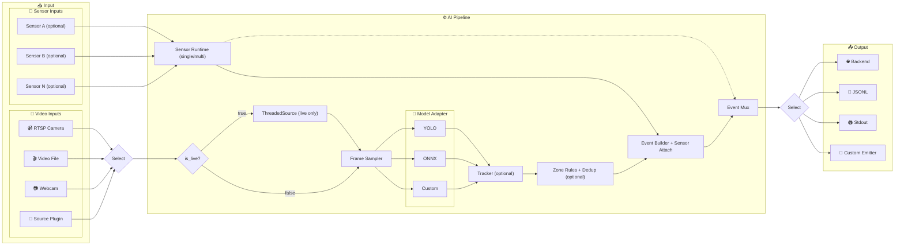

# schnitzel-stream-platform


> Extensible real-time video event pipeline
> 확장 가능한 실시간 비디오 이벤트 파이프라인

Python baseline: **3.11** (하위/상위 버전은 의존성 검증 후 단계적으로 확장)

---

## 🎯 Overview | 개요

### English

This project provides a production-ready AI pipeline that:

- Connects to CCTV cameras via **RTSP** (with auto-reconnect)
- Runs **object detection** models (YOLO, ONNX, or custom)
- Detects domain events (intrusion, PPE violation, posture, hazard)
- Sends structured events to a **backend API**

Designed for **plug-and-play** extensibility: add new models or event types via config, not code.

### 한국어

이 프로젝트는 실시간 영상 이벤트 처리를 위한 AI 파이프라인입니다:

- **RTSP** 카메라 연결 (자동 재연결 지원)
- **객체 탐지** 모델 실행 (YOLO, ONNX, 커스텀)
- 안전 이벤트 감지 (침입, 보호구 미착용, 자세 이상, 위험 상황)
- **백엔드 API**로 구조화된 이벤트 전송

설정만으로 새 모델/이벤트 타입을 추가할 수 있는 **확장 가능한 구조**입니다.

---

## 🏗️ Architecture | 아키텍처



> **Model Extensibility**: `AI_MODEL_ADAPTER` 환경변수로 모델 교체/추가. 콤마 구분으로 멀티 모델 동시 실행(예: `adapterA:ClassA,adapterB:ClassB`).
>
> | Adapter | 설명 |
> |:---|:---|
> | `YOLOAdapter` | Ultralytics YOLO (pt) |
> | `ONNXYOLOAdapter` | ONNX 최적화 추론 |
> | `Custom` | `infer(frame)` 하나만 구현 |

> **Input/Output Contract**: 다이어그램의 `Select`는 입력/출력 모두 `one-of` 단일 경로 선택을 의미합니다. (fan-in/fan-out 아님)
>
> **Sensor Extensibility**: `AI_SENSOR_ENABLED=true` + `AI_SENSOR_ADAPTER`(단일) 또는 `AI_SENSOR_ADAPTERS`(콤마 구분 다중)로 센서 플러그인을 로드해 이벤트 `sensor` 필드에 주입.
>
> **Output Selection**: 런타임은 fan-out이 아니라 단일 경로 선택입니다 (`--output-jsonl` > `--dry-run` > `AI_EVENTS_EMITTER_ADAPTER` > backend).
>
> **Final Decision Ownership**: 기본값은 런타임이 감지/융합 근거 이벤트를 전달하고, 최종 위험/알람 판단은 사용자 운영 정책에서 결정합니다. 필요 시 백엔드 룰 엔진 또는 런타임 내부 룰/플러그인으로 최종 판단 단계를 확장할 수 있습니다.


---

## ⚡ Quickstart | 빠른 시작

### 1) Clone & Install

```bash
git clone https://github.com/KyunghoCha/schnitzel-stream-platform.git
cd schnitzel-stream-platform
pip install -r requirements.txt
```

### 2) Dry-Run (Sample Video, No Backend)

Windows (Recommended):

```powershell
$env:AI_MODEL_MODE="mock"
$env:AI_ZONES_SOURCE="none"
./setup_env.ps1
python -m ai.pipeline `
  --dry-run `
  --max-events 20
```

Linux/Bash:

```bash
export AI_MODEL_MODE=mock
export AI_ZONES_SOURCE=none
export PYTHONPATH=src

python -m ai.pipeline \
  --dry-run \
  --max-events 20
```

### 3) Webcam Dry-Run (No Backend)

Windows:

```powershell
$env:AI_MODEL_MODE="mock"
$env:AI_ZONES_SOURCE="none"
./setup_env.ps1
python -m ai.pipeline `
  --source-type webcam `
  --camera-index 0 `
  --dry-run `
  --max-events 20
```

Linux/Bash:

```bash
export AI_MODEL_MODE=mock
export AI_ZONES_SOURCE=none
export PYTHONPATH=src

python -m ai.pipeline \
  --source-type webcam \
  --camera-index 0 \
  --dry-run \
  --max-events 20
```

### 4) RTSP Quick Test (Explicit Mock)

Windows:

```powershell
$env:AI_MODEL_MODE="mock"
$env:AI_ZONES_SOURCE="none"
./setup_env.ps1
python -m ai.pipeline `
  --source-type rtsp `
  --camera-id cam01 `
  --dry-run `
  --max-events 20
```

Linux/Bash:

```bash
export AI_MODEL_MODE=mock
export AI_ZONES_SOURCE=none
export PYTHONPATH=src

python -m ai.pipeline \
  --source-type rtsp \
  --camera-id cam01 \
  --dry-run \
  --max-events 20
```

### 5) Real YOLO Minimum Example

Real model runtime requires model dependencies:

Windows:

```powershell
pip install -r requirements-model.txt
$env:AI_MODEL_MODE="real"
$env:AI_MODEL_ADAPTER="ai.vision.adapters.yolo_adapter:YOLOAdapter"
$env:YOLO_MODEL_PATH="models/model.pt"
./setup_env.ps1
python -m ai.pipeline `
  --source-type rtsp `
  --camera-id cam01
```

Linux/Bash:

```bash
pip install -r requirements-model.txt

export AI_MODEL_MODE=real
export AI_MODEL_ADAPTER=ai.vision.adapters.yolo_adapter:YOLOAdapter
export YOLO_MODEL_PATH=models/model.pt
export PYTHONPATH=src

python -m ai.pipeline \
  --source-type rtsp \
  --camera-id cam01
```

That's it! 이벤트 로그가 터미널에 출력됩니다.
Real model path에서는 `requirements-model.txt` 설치가 필요합니다.

---

## 📦 Installation | 설치

### Core (Required)

```bash
pip install -r requirements.txt
```

Python: **3.10+** (runtime uses modern typing syntax such as `A | B`).

### Windows Environment Setup (Optional)

```powershell
# Auto-set PYTHONPATH and verify 'src' directory
./setup_env.ps1
```

### Development (Tests, Dashboard)

```bash
pip install -r requirements-dev.txt
```

### Model Runtime (YOLO/ONNX)

```bash
pip install -r requirements-model.txt
```

> **GPU (CUDA) on Windows**: PyTorch 재설치 필요
>
> ```bash
> pip install torch torchvision --index-url https://download.pytorch.org/whl/cu124
> ```

---

## 🔧 Configuration | 설정

### Runtime (Production-Focused)

| 환경변수 | 설명 | 기본값 |
| :--- | :--- | :--- |
| `AI_SOURCE_TYPE` | 입력 소스 타입 (`file`/`rtsp`/`webcam`/`plugin`) | `file` |
| `AI_SOURCE_ADAPTER` | 입력 Source 플러그인 경로 (`module:ClassName`, `AI_SOURCE_TYPE=plugin`일 때) | - |
| `AI_SENSOR_ENABLED` | 센서 축 스위치 (`true`면 센서 패킷을 이벤트에 주입) | `false` |
| `AI_SENSOR_TYPE` | 센서 타입 힌트 (`ros2`/`mqtt`/`modbus`/`serial`/`plugin`/custom 예: `ultrasonic`) | - |
| `AI_SENSOR_ADAPTER` | 센서 플러그인 단일 경로 (`module:ClassName`) | - |
| `AI_SENSOR_ADAPTERS` | 센서 플러그인 다중 경로 (콤마 구분, 예: `a:Front,b:Rear`) | - |
| `AI_SENSOR_TOPIC` | 센서 토픽/채널 힌트 | - |
| `AI_SENSOR_QUEUE_SIZE` | 센서 런타임 버퍼 크기 | `256` |
| `AI_SENSOR_TIME_WINDOW_MS` | 이벤트-센서 매칭 시간창(ms) | `300` |
| `AI_SENSOR_EMIT_EVENTS` | 독립 `SENSOR_EVENT` 전송 활성화 | `false` |
| `AI_SENSOR_EMIT_FUSED_EVENTS` | 추가 `FUSED_EVENT` 전송 활성화 | `false` |
| `AI_MODEL_MODE` | `real` / `mock` (`운영 권장: real`) | `real` |
| `AI_MODEL_ADAPTER` | Adapter 모듈 경로 (real 모드 필수, 기본 템플릿은 구현 전 fail-fast) | `ai.vision.adapters.custom_adapter:CustomModelAdapter` |
| `AI_EVENTS_EMITTER_ADAPTER` | 출력 Emitter 플러그인 경로 (`module:ClassName`) | - |
| `AI_RTSP_TRANSPORT` | RTSP 전송 프로토콜 (`tcp`/`udp`) | `tcp` |
| `AI_ZONES_SOURCE` | Zone 소스 (`api`/`file`/`none`, `none`이면 zone 평가 비활성) | `api` |
| `AI_LOG_LEVEL` | 로그 레벨 (`DEBUG`/`INFO`/`WARNING`) | `INFO` |

### Integration / Plugin Optional

| 환경변수 | 설명 | 기본값 |
| :--- | :--- | :--- |
| `AI_ROS2_SOURCE_TOPIC` | ROS2 입력 토픽 (ROS2 source plugin 사용 시) | `/camera/image_raw/compressed` |
| `AI_ROS2_EVENT_TOPIC` | ROS2 출력 토픽 (ROS2 emitter plugin 사용 시) | `/ai/events` |
| `YOLO_MODEL_PATH` | YOLO 가중치 경로 | - |
| `ONNX_MODEL_PATH` | ONNX 모델 경로 | - |
| `TRACKER_TYPE` | `none` / `iou` / `bytetrack` | `none` |
| `MODEL_CLASS_MAP_PATH` | 클래스 매핑 YAML | - |

### Test / Mock / Fake Only

| 환경변수 | 설명 | 기본값 |
| :--- | :--- | :--- |
| `AI_MODEL_MODE=mock` | 테스트/검증용 모드 (운영 비권장) | - |
| `AI_FAKE_SENSOR_ID` | fake 센서 ID(로컬 테스트용) | `ultrasonic-front-01` |
| `AI_FAKE_SENSOR_INTERVAL_SEC` | fake 센서 패킷 간격(로컬 테스트용) | `0.05` |
| `LOG_DIR` | RTSP E2E/로컬 검사용 로그 디렉터리 | - |
| `CHECK_PORT` | RTSP E2E 스크립트 포트 체크 시작점 | - |

전체 설정: `configs/default.yaml`

참고: `PYTHON_BIN`은 `scripts/legacy/*.sh`에서만 사용하는 레거시 변수입니다. 현재 Python 실행 스크립트(`scripts/*.py`)는 `sys.executable`을 사용합니다.

참고: `AI_SENSOR_ENABLED=true`이면 센서 플러그인에서 읽은 최근 패킷을 각 비전 이벤트의 `sensor` 필드에 주입합니다. `AI_SENSOR_ADAPTERS`를 쓰면 여러 센서를 동시에 수집하고 시간창 기준으로 가장 가까운 센서 패킷을 붙입니다. `AI_SENSOR_EMIT_EVENTS=true`면 독립 `SENSOR_EVENT`, `AI_SENSOR_EMIT_FUSED_EVENTS=true`면 추가 `FUSED_EVENT`도 전송합니다. 최종 위험/알람 판단은 기본적으로 사용자 운영 정책에서 결정하고, 필요 시 백엔드/런타임 확장으로 자동화합니다.

### ROS2 Plugin Quickstart (Optional)

```bash
# ROS2 source plugin (input)
export AI_SOURCE_TYPE=plugin
export AI_SOURCE_ADAPTER=ai.plugins.ros2.image_source:Ros2ImageSource
export AI_ROS2_SOURCE_TOPIC=/camera/image_raw/compressed

# ROS2 emitter plugin (output)
export AI_EVENTS_EMITTER_ADAPTER=ai.plugins.ros2.event_emitter:Ros2EventEmitter
export AI_ROS2_EVENT_TOPIC=/ai/events

# Run
AI_MODEL_MODE=mock \
PYTHONPATH=src \
python -m ai.pipeline \
  --max-events 20
```

ROS2 plugin modules require ROS2 Python packages (`rclpy`, `sensor_msgs`, `std_msgs`).

### Sensor Lane Quickstart (No Hardware)

```bash
export AI_MODEL_MODE=mock
export AI_SENSOR_ENABLED=true
export AI_SENSOR_TYPE=ultrasonic
export AI_SENSOR_ADAPTER=ai.plugins.sensors.fake_ultrasonic:FakeUltrasonicSensorSource
export AI_SENSOR_TIME_WINDOW_MS=5000
export AI_SENSOR_EMIT_EVENTS=true
export AI_SENSOR_EMIT_FUSED_EVENTS=true

PYTHONPATH=src \
python -m ai.pipeline \
  --output-jsonl outputs/events_sensor.jsonl \
  --max-events 8
```

### Multi-Sensor Adapter Example

```bash
export AI_MODEL_MODE=mock
export AI_SENSOR_ENABLED=true
export AI_SENSOR_ADAPTERS="ai.plugins.sensors.fake_ultrasonic:FakeUltrasonicSensorSource,\
ai.plugins.sensors.serial_ultrasonic:SerialUltrasonicSensorSource"
export AI_SENSOR_TIME_WINDOW_MS=5000

PYTHONPATH=src \
python -m ai.pipeline \
  --dry-run \
  --max-events 20
```

---

## 📚 Documentation | 문서

| 문서 | 설명 |
| :--- | :--- |
| [docs/index.md](docs/index.md) | 문서 인덱스 |
| [docs/progress/roadmap.md](docs/progress/roadmap.md) | 진행 로드맵 |
| [docs/specs/pipeline_spec.md](docs/specs/pipeline_spec.md) | 파이프라인 명세 |
| [docs/specs/model_interface.md](docs/specs/model_interface.md) | 모델 인터페이스 계약 |
| [docs/ops/ops_runbook.md](docs/ops/ops_runbook.md) | 운영 가이드 |
| [docs/future/future_roadmap.md](docs/future/future_roadmap.md) | 로드맵 (다중 카메라, 자율학습) |

### Contracts & Policy | 계약 및 운영 정책

파이프라인의 핵심 계약(이벤트 스키마/모델 입출력/분류 정책)을 관리하는 문서입니다.

| 문서 | 설명 |
| :--- | :--- |
| [docs/contracts/protocol.md](docs/contracts/protocol.md) | 이벤트 스키마 및 전송 계약 |
| [docs/specs/model_interface.md](docs/specs/model_interface.md) | 모델 어댑터 입출력 계약 |
| [docs/specs/model_class_taxonomy.md](docs/specs/model_class_taxonomy.md) | 클래스 분류/정책 기준 |
| [docs/progress/roadmap.md](docs/progress/roadmap.md) | 결정 필요 항목 및 진행 현황 |

---

## 🧪 Testing | 테스트

```bash
# Unit + Integration
PYTEST_DISABLE_PLUGIN_AUTOLOAD=1 pytest -q

# Test hygiene (duplicate/meaningless test scan)
python scripts/test_hygiene.py

# RTSP E2E (sample video)
# (script forces AI_MODEL_MODE=mock explicitly)
python scripts/check_rtsp.py

# Regression (mock explicit)
AI_MODEL_MODE=mock PYTHONPATH=src python scripts/regression_check.py

# Multi-camera
python scripts/multi_cam.py start
python scripts/multi_cam.py stop
```

---

## 🐳 Docker

```bash
# Build
docker build -t schnitzel-stream-platform .

# Run (dry-run test path, explicit mock)
docker run --rm -e AI_MODEL_MODE=mock -v /tmp/snapshots:/data/snapshots schnitzel-stream-platform

# Run (real mode, requires concrete adapter/model config)
docker run --rm \
  -e AI_MODEL_MODE=real \
  -e AI_MODEL_ADAPTER=ai.vision.adapters.yolo_adapter:YOLOAdapter \
  -e YOLO_MODEL_PATH=/models/model.pt \
  schnitzel-stream-platform python -m ai.pipeline
```

---

## 📊 Project Status | 현황

| 항목 | 상태 |
| :--- | :--- |
| Non-model Pipeline | ✅ Complete |
| RTSP E2E (host/docker) | ✅ Complete |
| Model Adapters (YOLO/ONNX) | ✅ Complete |
| Multi-model Merge | ✅ Complete |
| Class Mapping | ✅ Complete |
| IOU Tracker | ✅ Complete |
| Codebase Audit (169 items) | ✅ Complete |
| Document Consistency (150+ files) | ✅ Complete |
| Tests (153 passed, 2 skipped on 2026-02-11) | ✅ Complete |
| Cross-Platform CI Matrix (Linux/Windows/macOS) | 🟨 Configured (run on GitHub Actions) |
| Real RTSP Device | 🔲 Pending (실환경 연동 대기) |
| Real Backend Integration | 🔲 Pending (외부 시스템 연동 대기) |
| Production Model Accuracy | 🔲 Pending (모델 확정 후) |
| IoT Sensor Integration | 🟨 Baseline Complete (sensor/fused runtime, hardware integration pending) |

---

## 📝 License | 라이센스

Apache License 2.0 (`LICENSE`)

---

## 🤝 Contributing | 기여

1. Fork this repository
2. Create a feature branch
3. Submit a Pull Request

---

<p align="center">
  Made by <b>Kyungho Cha</b>
  <br>
  Copyright (c) 2026. All rights reserved.
</p>
