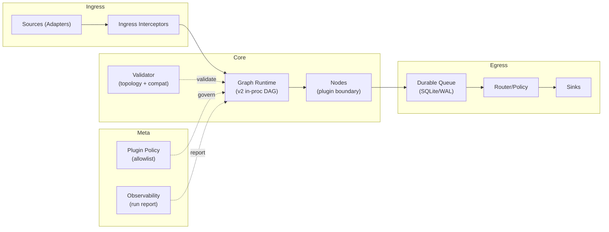

# schnitzel-stream-platform


> Edge-first universal stream processing platform
> 엣지 우선 범용 스트림 플랫폼

Stable entrypoint (SSOT): `python -m schnitzel_stream`

---

## English

### Overview

This repo is pivoting from a CCTV/video-specific pipeline into a **general-purpose stream platform**.

What you get today:

- v1 job graphs (legacy runtime indirection, still supported)
- v2 node graphs (YAML) executed in-process (strict DAG)
- Static validation (topology + compatibility)
- Durable queue building blocks (SQLite WAL) for edge store-and-forward
- Minimal observability contract (JSON run report + metric naming)

SSOT docs:

- Execution roadmap: `docs/roadmap/execution_roadmap.md`
- StreamPacket: `docs/contracts/stream_packet.md`
- Observability: `docs/contracts/observability.md`

### Architecture

#### Platform View (Ingress/Core/Egress/Meta)



#### v1 Compatibility (Legacy Job Graph)

v1 graphs exist to keep migration reversible while the v2 platform evolves.

- Default v2 graph: `configs/graphs/dev_vision_e2e_mock_v2.yaml`
- Legacy v1 graph (deprecated): `configs/graphs/legacy_pipeline.yaml`
- Legacy runtime is quarantined under `legacy/ai/` (import path remains `ai.*` via `src/ai` shim) and is executed via the v1 job graph.

---

### Quickstart

#### 1) Install

```bash
pip install -r requirements.txt
```

#### 2) Environment

```powershell
# Windows (recommended)
./setup_env.ps1
```

```bash
# Linux/macOS
export PYTHONPATH=src
```

#### 3) Validate (no run)

```bash
# default v2 graph
python -m schnitzel_stream validate

# legacy v1 graph
python -m schnitzel_stream validate --graph configs/graphs/legacy_pipeline.yaml
```

#### 4) Run Default v2 Graph (E2E Mock CCTV)

```bash
python -m schnitzel_stream
```

#### 5) Run v2 In-Proc Demo Graph

```bash
python -m schnitzel_stream --graph configs/graphs/dev_inproc_demo_v2.yaml

# JSON run report (metrics)
python -m schnitzel_stream --graph configs/graphs/dev_inproc_demo_v2.yaml --report-json
```

#### 6) Durable Queue Demo (SQLite WAL)

```bash
# enqueue
python -m schnitzel_stream --graph configs/graphs/dev_durable_enqueue_v2.yaml

# drain + ack
python -m schnitzel_stream --graph configs/graphs/dev_durable_drain_ack_v2.yaml
```

#### 7) Run Legacy Video Pipeline (Optional)

The legacy pipeline is executed through the v1 job graph and uses the Phase 0 compatibility CLI flags.

For a local smoke run without real model deps/backends:

```powershell
# PowerShell
$env:AI_MODEL_MODE="mock"
$env:AI_ZONES_SOURCE="none"
python -m schnitzel_stream --graph configs/graphs/legacy_pipeline.yaml --dry-run --max-events 5
```

More details: `docs/ops/command_reference.md`

---

### Graph Spec Formats

#### v1 (job graph)

```yaml
version: 1
job: schnitzel_stream.jobs.legacy_ai_pipeline:LegacyAIPipelineJob
config: {}
```

#### v2 (node graph)

- `plugin` must be `module:ClassName`
- `kind` is currently: `source`, `node`, `sink` (reserved: `delay`, `initial`)

```yaml
version: 2
nodes:
  - id: src
    kind: source
    plugin: schnitzel_stream.nodes.dev:StaticSource
    config:
      packets: []
  - id: out
    kind: sink
    plugin: schnitzel_stream.nodes.dev:PrintSink
edges:
  - from: src
    to: out
config: {}
```

---

### Plugin Policy

By default, plugin loading is allowlisted to repo namespaces (`schnitzel_stream.*`, `ai.*`).

- `ALLOWED_PLUGIN_PREFIXES` (comma-separated prefixes)
- `ALLOW_ALL_PLUGINS=true` (dev only)

---

### Documentation

Start here:

- `docs/index.md`

Key SSOT docs:

- `docs/roadmap/execution_roadmap.md`
- `docs/roadmap/strategic_roadmap.md`
- `docs/contracts/stream_packet.md`
- `docs/contracts/observability.md`

---

### Project Status

Authoritative status is tracked in: `docs/roadmap/execution_roadmap.md`

| Track | Status |
| :--- | :--- |
| Phase 0 (Entrypoint SSOT) | DONE |
| Phase 1 (v2 in-proc DAG runtime) | DONE |
| Phase 2 (Durable queue hardening) | DONE |
| Phase 3 (Control plane) | IN PROGRESS (`P3.3` is optional) |

---

### License

Apache License 2.0 (`LICENSE`)

---

### Contributing

1. Fork this repository
2. Create a feature branch
3. Submit a Pull Request

---

## 한국어

### 개요

이 레포는 CCTV/영상 파이프라인에서 출발했지만, 이제는 **범용 스트림 플랫폼**으로 피벗 중입니다.

현재 제공되는 것:

- v1 job 그래프(레거시 런타임 우회/호환 유지)
- v2 node graph(YAML) in-proc 실행(엄격 DAG)
- 정적 검증(토폴로지 + 호환성)
- 엣지 store-and-forward용 durable queue 빌딩블록(SQLite WAL)
- 최소 관측 가능성 계약(JSON 실행 리포트 + 메트릭 네이밍)

SSOT 문서:

- 실행 로드맵: `docs/roadmap/execution_roadmap.md`
- StreamPacket: `docs/contracts/stream_packet.md`
- Observability: `docs/contracts/observability.md`

### 아키텍처

#### 플랫폼 뷰 (Ingress/Core/Egress/Meta)


#### v1 호환성 (Legacy Job Graph)

v1 그래프는 v2 플랫폼이 진화하는 동안 마이그레이션을 되돌릴 수 있도록(가역성) 유지됩니다.

- 기본 v2 그래프: `configs/graphs/dev_vision_e2e_mock_v2.yaml`
- 레거시 v1 그래프(deprecated): `configs/graphs/legacy_pipeline.yaml`
- 레거시 런타임은 `legacy/ai/` 아래에 격리되어 있으며(`src/ai` shim을 통해 import 경로 `ai.*` 유지), v1 job 그래프로 실행됩니다.

---

### 빠른 시작

#### 1) 설치

```bash
pip install -r requirements.txt
```

#### 2) 환경

```powershell
# Windows (권장)
./setup_env.ps1
```

```bash
# Linux/macOS
export PYTHONPATH=src
```

#### 3) 검증(실행 안 함)

```bash
# 기본 v2 그래프
python -m schnitzel_stream validate

# 레거시 v1 그래프
python -m schnitzel_stream validate --graph configs/graphs/legacy_pipeline.yaml
```

#### 4) 기본 v2 그래프 실행 (E2E Mock CCTV)

```bash
python -m schnitzel_stream
```

#### 5) v2 In-Proc 데모 그래프 실행

```bash
python -m schnitzel_stream --graph configs/graphs/dev_inproc_demo_v2.yaml

# JSON 실행 리포트 (metrics)
python -m schnitzel_stream --graph configs/graphs/dev_inproc_demo_v2.yaml --report-json
```

#### 6) Durable Queue 데모 (SQLite WAL)

```bash
# enqueue
python -m schnitzel_stream --graph configs/graphs/dev_durable_enqueue_v2.yaml

# drain + ack
python -m schnitzel_stream --graph configs/graphs/dev_durable_drain_ack_v2.yaml
```

#### 7) 레거시 비디오 파이프라인 실행 (선택)

레거시 파이프라인은 v1 job 그래프로 실행되며, Phase 0 호환 CLI 플래그를 사용합니다.

실제 모델/백엔드 의존성 없이 로컬 스모크 테스트를 하려면:

```powershell
# PowerShell
$env:AI_MODEL_MODE="mock"
$env:AI_ZONES_SOURCE="none"
python -m schnitzel_stream --graph configs/graphs/legacy_pipeline.yaml --dry-run --max-events 5
```

자세한 내용: `docs/ops/command_reference.md`

---

### 그래프 스펙 포맷

#### v1 (job graph)

```yaml
version: 1
job: schnitzel_stream.jobs.legacy_ai_pipeline:LegacyAIPipelineJob
config: {}
```

#### v2 (node graph)

- `plugin`은 `module:ClassName` 형식이어야 합니다.
- `kind`는 현재 `source`, `node`, `sink` (예약: `delay`, `initial`) 입니다.

```yaml
version: 2
nodes:
  - id: src
    kind: source
    plugin: schnitzel_stream.nodes.dev:StaticSource
    config:
      packets: []
  - id: out
    kind: sink
    plugin: schnitzel_stream.nodes.dev:PrintSink
edges:
  - from: src
    to: out
config: {}
```

---

### 플러그인 정책

기본적으로 플러그인 로딩은 레포 네임스페이스(`schnitzel_stream.*`, `ai.*`)로 allowlist 됩니다.

- `ALLOWED_PLUGIN_PREFIXES` (콤마로 구분된 prefix)
- `ALLOW_ALL_PLUGINS=true` (dev 전용)

---

### 문서

시작 지점:

- `docs/index.md`

핵심 SSOT 문서:

- `docs/roadmap/execution_roadmap.md`
- `docs/roadmap/strategic_roadmap.md`
- `docs/contracts/stream_packet.md`
- `docs/contracts/observability.md`

---

### 현황

권위 있는 상태(Authoritative status)는 `docs/roadmap/execution_roadmap.md` 에서 추적합니다.

| 트랙 | 상태 |
| :--- | :--- |
| Phase 0 (Entrypoint SSOT) | DONE |
| Phase 1 (v2 in-proc DAG runtime) | DONE |
| Phase 2 (Durable queue hardening) | DONE |
| Phase 3 (Control plane) | IN PROGRESS (`P3.3` is optional) |

---

### 라이센스

Apache License 2.0 (`LICENSE`)

---

### 기여

1. Fork this repository
2. Create a feature branch
3. Submit a Pull Request

---

<p align="center">
  Made with ❤️ by <b>Kyungho Cha</b>
</p>
