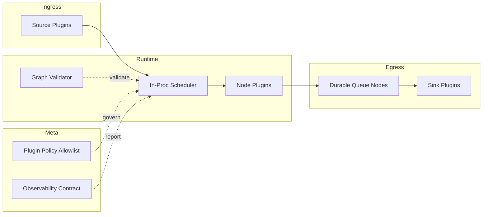
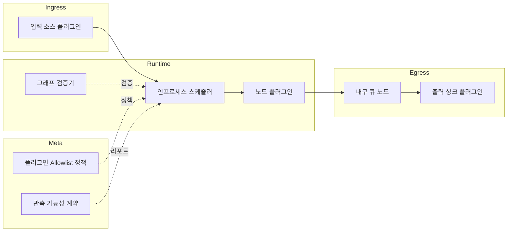

# schnitzel-stream-platform


> Edge-first universal stream processing platform
> 엣지 우선 범용 스트림 플랫폼

Stable entrypoint (SSOT): `python -m schnitzel_stream`

---

## English

### Overview

`schnitzel-stream-platform` is a v2 node-graph runtime for stream processing.

Current focus:
- portable node graph execution (`version: 2`)
- strict graph validation (topology + compatibility)
- plugin-based IO/policy nodes
- durable queue primitives (SQLite/WAL)
- edge-oriented ops conventions

Legacy v1 runtime (`ai.*`, job graph) has been removed from `main`.

### Architecture



### Quickstart

1. Install

```bash
pip install -r requirements.txt
```

2. Environment

```powershell
# Windows
./setup_env.ps1
```

```bash
# Linux/macOS
export PYTHONPATH=src
```

3. Validate

```bash
python -m schnitzel_stream validate
```

4. Run default v2 graph

```bash
python -m schnitzel_stream
```

5. Useful demo graphs

```bash
python -m schnitzel_stream --graph configs/graphs/dev_inproc_demo_v2.yaml
python -m schnitzel_stream --graph configs/graphs/dev_durable_enqueue_v2.yaml
python -m schnitzel_stream --graph configs/graphs/dev_durable_drain_ack_v2.yaml
python -m schnitzel_stream --graph configs/graphs/dev_rtsp_frames_v2.yaml
python -m schnitzel_stream --graph configs/graphs/dev_webcam_frames_v2.yaml
python -m schnitzel_stream --graph configs/graphs/dev_http_event_sink_v2.yaml
python -m schnitzel_stream --graph configs/graphs/dev_jsonl_sink_v2.yaml
```

### Graph Spec (v2)

- `plugin` format: `module:ClassName`
- node `kind`: `source`, `node`, `sink` (reserved: `delay`, `initial`)

```yaml
version: 2
nodes:
  - id: src
    kind: source
    plugin: schnitzel_stream.nodes.dev:StaticSource
    config:
      packets: []
  - id: out
    kind: sink
    plugin: schnitzel_stream.nodes.dev:PrintSink
edges:
  - from: src
    to: out
config: {}
```

### Plugin Policy

Default allowlist is `schnitzel_stream.*`.

- `ALLOWED_PLUGIN_PREFIXES` (comma-separated prefixes)
- `ALLOW_ALL_PLUGINS=true` (dev only)

### Documentation

- Docs index: `docs/index.md`
- Execution SSOT: `docs/roadmap/execution_roadmap.md`
- StreamPacket contract: `docs/contracts/stream_packet.md`
- Observability contract: `docs/contracts/observability.md`

---

## 한국어

### 개요

`schnitzel-stream-platform`은 v2 노드 그래프 기반 스트림 처리 런타임입니다.

현재 핵심:
- `version: 2` 노드 그래프 실행
- 그래프 정적 검증(토폴로지 + 호환성)
- 플러그인 기반 입출력/정책 노드
- 내구 큐(SQLite/WAL) 빌딩블록
- 엣지 운영 관례 정리

레거시 v1 런타임(`ai.*`, job graph)은 `main`에서 제거되었습니다.

### 아키텍처



### 빠른 시작

1. 설치

```bash
pip install -r requirements.txt
```

2. 환경 설정

```powershell
# Windows
./setup_env.ps1
```

```bash
# Linux/macOS
export PYTHONPATH=src
```

3. 검증

```bash
python -m schnitzel_stream validate
```

4. 기본 v2 그래프 실행

```bash
python -m schnitzel_stream
```

5. 주요 데모 그래프

```bash
python -m schnitzel_stream --graph configs/graphs/dev_inproc_demo_v2.yaml
python -m schnitzel_stream --graph configs/graphs/dev_durable_enqueue_v2.yaml
python -m schnitzel_stream --graph configs/graphs/dev_durable_drain_ack_v2.yaml
python -m schnitzel_stream --graph configs/graphs/dev_rtsp_frames_v2.yaml
python -m schnitzel_stream --graph configs/graphs/dev_webcam_frames_v2.yaml
python -m schnitzel_stream --graph configs/graphs/dev_http_event_sink_v2.yaml
python -m schnitzel_stream --graph configs/graphs/dev_jsonl_sink_v2.yaml
```

### 그래프 스펙(v2)

- `plugin` 형식: `module:ClassName`
- 노드 `kind`: `source`, `node`, `sink` (예약: `delay`, `initial`)

```yaml
version: 2
nodes:
  - id: src
    kind: source
    plugin: schnitzel_stream.nodes.dev:StaticSource
    config:
      packets: []
  - id: out
    kind: sink
    plugin: schnitzel_stream.nodes.dev:PrintSink
edges:
  - from: src
    to: out
config: {}
```

### 플러그인 정책

기본 allowlist는 `schnitzel_stream.*` 입니다.

- `ALLOWED_PLUGIN_PREFIXES` (콤마 구분 prefix)
- `ALLOW_ALL_PLUGINS=true` (개발용)

### 문서

- 문서 인덱스: `docs/index.md`
- 실행 SSOT: `docs/roadmap/execution_roadmap.md`
- StreamPacket 계약: `docs/contracts/stream_packet.md`
- 관측 가능성 계약: `docs/contracts/observability.md`

---

### License

Apache License 2.0 (`LICENSE`)

---

<p align="center">
  Made with ❤️ by <b>Kyungho Cha</b>
</p>
