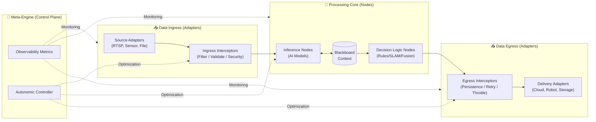

# Strategic Roadmap: Resilient Autonomous Intelligent Stream Platform (schnitzel-stream-platform)

본 문서는 `schnitzel-stream-platform` 프로젝트가 고성능 Edge-AI 추론 엔진을 넘어, 데이터 무결성 보장 및 자율 최적화 기능을 갖춘 **범용 지능형 스트림 가공 플랫폼(Common Intelligent Stream Platform)**으로 진화하기 위한 기술 전략과 아키텍처 로드맵을 정의합니다.

---

## 🏗️ 1. Architecture Vision: "The Intelligent Middleware Pipeline"

핵심 아키텍처는 데이터 수집(Ingress), 처리(Processing), 전송(Egress) 레이어를 완전히 분리(Decoupling)하고, 각 레이어 사이에 **관점 지향(AOP) 미들웨어 인터셉터**를 배치하여 확장성과 회복 탄력성을 극대화하는 구조입니다.

---

## 📅 2. 단계적 진화 로드맵 (Evolution Phases)

### Phase 1: Robust Foundation & Edge Resiliency (신뢰성 확보)
*엣지 환경의 불안정성에 대응하여 데이터 손실을 방지하고 중단 없는 분석 성능을 확보하는 단계.*

*   **1.1 Async Processing & I/O Isolation [DONE]**
    *   `FrameProcessor` 워커 스레드 도입을 통해 추론 대기 시간이 렌더링/캡처 주기에 영향을 주지 않도록 구현 완료.
*   **1.2 Multi-modal Sensor Fusion [DONE]**
    *   `MultiSensorRuntime`을 통한 이기종 센서 데이터의 비동기 수집 및 시간축 동기화(Interpolation) 구조 확정.
*   **1.3 Fault-Tolerant Failover [DONE]**
    *   백엔드 가용성 저하 시 자가 진단 및 `Dry-run mode` 자동 강등을 통한 시스템 연속성 보장.
*   **1.4 Durable Message Persistence (Store-and-Forward) [NEXT]**
    *   네트워크 단절 시 로컬 DB(SQLite)에 이벤트를 영구 저장하고, 복구 시 지수 백오프 기반으로 릴레이 송신하는 미들웨어 구축.

---

### Phase 2: Interoperable Plugin & State Management (상호 운용성)
*데이터 규격을 일반화하고 노드 간 협업을 위한 중앙 상태 관리 체계를 구축하는 단계.*

*   **2.1 Generalized Stream Packet Strategy**
    *   [Header+Payload] 규격의 `StreamPacket` 표준화로 Video, Lidar, Audio 등 모든 데이터를 동일 관에서 처리.
*   **2.2 Blackboard Pattern Core**
    *   노드 간 직접 통신을 배제하고 공유 컨텍스트(`Blackboard`)를 통해 데이터를 교환하는 '느슨한 결합' 아키텍처 구현.
*   **2.3 Real-time Node Hot-swapping**
    *   서비스 재시작 없이 설정 변경만으로 분석 모델 및 처리 로직을 실시간 교체하는 기술.

---

### Phase 3: AOP Middleware Framework (자율 무장 아키텍처)
*공통 기능(재시도, 보안, 로깅)을 비즈니스 로직에서 분리하여 인터셉터로 모듈화하는 단계.*

*   **3.1 Interceptor Registry & Lifecycle**
    *   플러그인화된 미들웨어를 파이프라인 전/후처리기에 동적으로 배치하는 프레임워크 구축.
*   **3.2 Context-aware Armor Injection**
    *   배포 환경(실외/실내/저전력)에 따라 최적의 미들웨어(노이즈 필터, 전송 가속 등)를 시스템이 자율적으로 선택.

---

### Phase 4: Autonomic Meta-Engine (자가 최적화)
*시스템이 스스로의 지표를 학습하여 최적의 성능과 안정성을 유지하는 자율 컴퓨팅 단계.*

*   **4.1 AI-Driven Observability**
    *   시스템 메트릭을 분석하여 장애 징조를 사전에 감지하고 최적의 환경 설정을 추천하는 관리형 AI 탑재.
*   **4.2 Adaptive Resource Scheduling**
    *   배터리나 네트워크 상태에 따라 모델 해상도, 추론 주기(FPS) 등을 실시간으로 조정하는 동적 스케줄링.

---

## 📊 3. 현재 구현 현황 및 기술적 부채 (Status & Technical Debt)

| 영역 | 현황 (Current Capability) | 기술적 부채 및 향후 과제 (Technical Debt) |
| :--- | :--- | :--- |
| **Ingress** | RTSP/Webcam 및 멀티 센서 수집 완료 | OpenCV 기반 하드코딩된 소스 로직의 어댑터 분리 필요 |
| **Logic** | 모델 어댑터 패턴으로 YOLO/ONNX 교체 가능 | 상이한 데이터 타입 간의 통일된 규격(`StreamPacket`) 부재 |
| **Egress** | Cloud/File/Stdout 다중 에미터 지원 | 송신 실패 방어 로직이 에미터 내부에 종속되어 재사용성 낮음 |
| **Pipeline** | 비차단 멀티스레드 아키텍처 정착 | 순차적 실행 구조 고착 (유연한 DAG 워크플로우 지원 필요) |

---

## 🛡️ 4. Middleware Catalog (회복 탄력성 인터셉터 목록)

파이프라인의 각 접점에 주입하여 안정성을 높이는 공통 모듈들입니다.

1.  **Retry Interceptor**: 전송 실패 시 지수 백오프 전략을 통한 자동 복구.
2.  **Persistence Middleware**: 오프라인 구간 데이터 보호를 위한 로컬 버퍼링.
3.  **Circuit Breaker**: 외부 연동 시스템 장애 확산 방지를 위한 연결 차단.
4.  **Schema Validator**: 입출력 데이터의 규격 무결성 실시간 검증.
5.  **Traffic Throttler**: 시스템 부하에 따른 우선순위 기반 데이터 손실 제어.

---

## 🎯 5. 최종 비즈니스 가치 (Business Value)

우리는 단순히 AI 코드를 짜는 것이 아니라, **"어떤 하드웨어나 네트워크 환경에서도 데이터 유실 없이 스스로 최적화하며 구동되는 플랫폼"**을 만드는 것입니다. 이는 실무 현장에서 유지보수 비용을 90% 이상 절감하고, 다양한 도메인(로봇, 스마트 팩토리, 금융 관제)으로 즉시 확장이 가능한 독보적인 가치를 가집니다.

---
**Last Updated**: 2026-02-12
**Project Owner**: Kyungho Cha
**Brand**: Schnitzel
