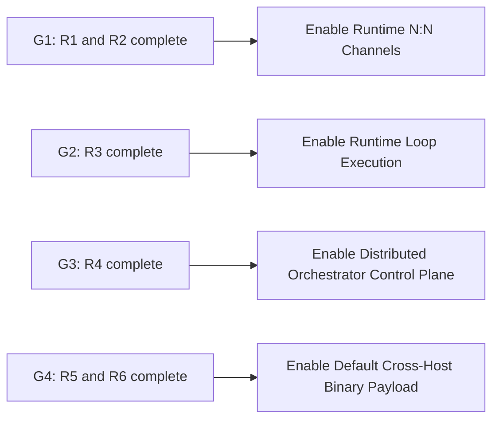
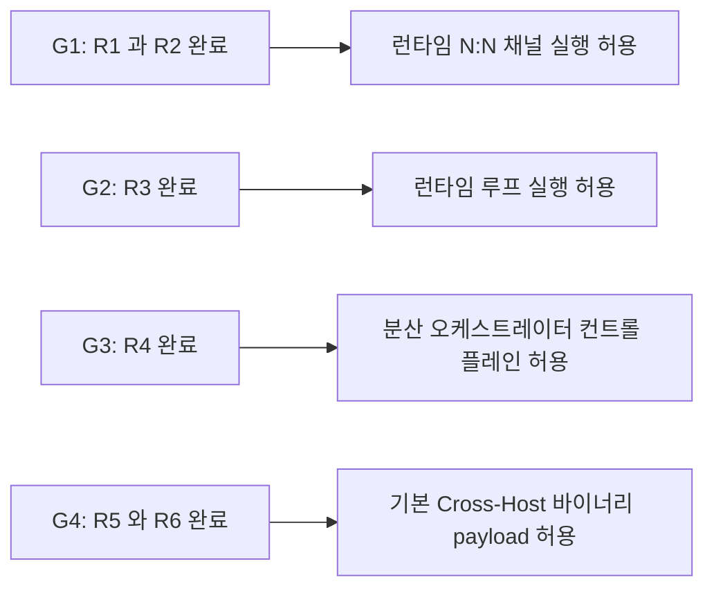

# Future Structure Blueprint

Last updated: 2026-02-16

## English

This document captures the target future structure of the platform in one visual map.
It combines current implementation, backlog work, and research-gated areas.

## Future Architecture Map

```mermaid
flowchart LR
  U["User or Operator"]

  subgraph A["Authoring and Experience Layer"]
    A1["CLI Profiles (Now)"]
    A2["TUI or GUI Graph Editor (Future)"]
    A3["Template and Scaffold SDK"]
    A4["Graph Build and Validation"]
  end

  subgraph S["Specification Layer"]
    S1["Node Graph Spec v2"]
    S2["Process Graph Spec v1"]
    S3["Future Process Graph v2: N:N and Loop Policy"]
  end

  subgraph R["Execution Layer"]
    R1["In-Proc Graph Runtime (Done)"]
    R2["Process Graph Validator (Done)"]
    R3["Local Multi-Process Launcher (Done)"]
    R4["Process Graph Orchestrator Runtime (Research)"]
  end

  subgraph P["Plugin and Policy Layer"]
    P1["Source Plugins (RTSP Webcam File MQTT ROS)"]
    P2["Model Adapter Plugins (YOLO ONNX TensorRT LLM)"]
    P3["Policy Pack (Retry Timeout Backpressure Dedup)"]
    P4["Sink Plugins (HTTP Queue File DB ROS)"]
  end

  subgraph D["Data and Portability Layer"]
    D1["StreamPacket Contract (Done)"]
    D2["Durable Channel SQLite 1:1 (Done)"]
    D3["Future Channel N:N Semantics (Research)"]
    D4["payload_ref Local File (Done)"]
    D5["payload_ref URI Object Store (Research)"]
  end

  subgraph O["Observability and Governance"]
    O1["Metrics Health and Reports (Done)"]
    O2["Static Showcase Visualization (Done)"]
    O3["Live UI Dashboard (Backlog)"]
    O4["Plugin Security and Governance Baseline (Research)"]
  end

  U --> A1
  U --> A2
  A1 --> A4
  A2 --> A4
  A3 --> A4
  A4 --> S1
  A4 --> S2
  A4 --> S3

  S1 --> R1
  S2 --> R2
  R2 --> R3
  S3 --> R4

  R1 --> P1
  P1 --> P2
  P2 --> P3
  P3 --> P4

  P4 --> D1
  D1 --> D2
  D2 --> D3
  D1 --> D4
  D4 --> D5

  R1 --> O1
  R3 --> O1
  O1 --> O2
  O1 --> O3
  O4 -. guards .-> P1
  O4 -. guards .-> P2
  O4 -. guards .-> P4
```

Current operator command surfaces in this direction:
- `python scripts/stream_fleet.py ...` (primary fleet runner)
- `python scripts/stream_monitor.py ...` (read-only stream TUI)

## Research Gate Map

---

## 한국어

이 문서는 플랫폼의 미래 구조를 한 번에 볼 수 있도록 정리한 시각화 문서다.
현재 완료된 기반, 백로그 후보, 연구 게이트 항목을 같은 그림에서 연결한다.

## 미래 아키텍처 지도

```mermaid
flowchart LR
  U["사용자 또는 운영자"]

  subgraph A["작성 및 사용성 계층"]
    A1["CLI 프로필 실행 (현재)"]
    A2["TUI 또는 GUI 그래프 에디터 (미래)"]
    A3["템플릿 및 스캐폴드 SDK"]
    A4["그래프 빌드 및 검증"]
  end

  subgraph S["명세 계층"]
    S1["노드 그래프 스펙 v2"]
    S2["프로세스 그래프 스펙 v1"]
    S3["미래 프로세스 그래프 v2: N:N 및 루프 정책"]
  end

  subgraph R["실행 계층"]
    R1["인프로세스 그래프 런타임 (완료)"]
    R2["프로세스 그래프 검증기 (완료)"]
    R3["로컬 멀티프로세스 런처 (완료)"]
    R4["프로세스 그래프 오케스트레이터 런타임 (연구)"]
  end

  subgraph P["플러그인 및 정책 계층"]
    P1["입력 플러그인 (RTSP Webcam File MQTT ROS)"]
    P2["모델 어댑터 플러그인 (YOLO ONNX TensorRT LLM)"]
    P3["정책 팩 (재시도 타임아웃 백프레셔 중복제거)"]
    P4["출력 플러그인 (HTTP Queue File DB ROS)"]
  end

  subgraph D["데이터 및 이식성 계층"]
    D1["StreamPacket 계약 (완료)"]
    D2["내구 채널 SQLite 1:1 (완료)"]
    D3["미래 채널 N:N 의미론 (연구)"]
    D4["payload_ref 로컬 파일 (완료)"]
    D5["payload_ref URI 오브젝트 스토어 (연구)"]
  end

  subgraph O["관측성과 거버넌스"]
    O1["메트릭 헬스 리포트 (완료)"]
    O2["정적 시연 시각화 (완료)"]
    O3["실시간 UI 대시보드 (백로그)"]
    O4["플러그인 보안 및 거버넌스 기준선 (연구)"]
  end

  U --> A1
  U --> A2
  A1 --> A4
  A2 --> A4
  A3 --> A4
  A4 --> S1
  A4 --> S2
  A4 --> S3

  S1 --> R1
  S2 --> R2
  R2 --> R3
  S3 --> R4

  R1 --> P1
  P1 --> P2
  P2 --> P3
  P3 --> P4

  P4 --> D1
  D1 --> D2
  D2 --> D3
  D1 --> D4
  D4 --> D5

  R1 --> O1
  R3 --> O1
  O1 --> O2
  O1 --> O3
  O4 -. 보호 게이트 .-> P1
  O4 -. 보호 게이트 .-> P2
  O4 -. 보호 게이트 .-> P4
```

현재 운영 명령 표면은 아래 방향으로 정리한다.
- `python scripts/stream_fleet.py ...` (주 fleet 실행기)
- `python scripts/stream_monitor.py ...` (읽기 전용 stream TUI)

## 연구 게이트 지도

