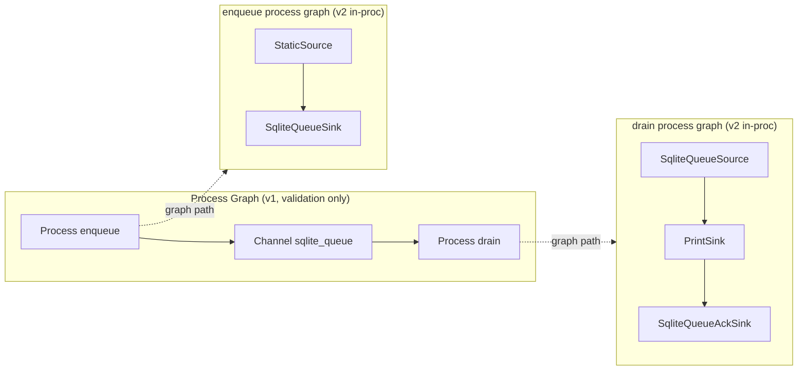
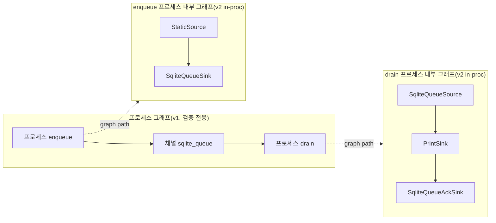

# Process Graph Foundation Guide

Last updated: 2026-02-16

## English

## Purpose

This guide defines the Phase 12 foundation model:
- in-proc node graphs remain the execution runtime
- process graph is a higher-level contract for cross-process wiring
- current scope is specification/validation only (no orchestration runtime yet)

## In-Proc Graph vs Process Graph



## Spec (v1)

Path:
- `configs/process_graphs/*.yaml`

Example:

```yaml
version: 1
processes:
  - id: enqueue
    graph: configs/graphs/dev_durable_enqueue_v2.yaml
  - id: drain
    graph: configs/graphs/dev_durable_drain_ack_v2.yaml
channels:
  - id: q_main
    kind: sqlite_queue
    path: outputs/queues/dev_demo.sqlite3
    require_ack: true
links:
  - producer: enqueue
    consumer: drain
    channel: q_main
```

## Validation Rules (Foundation)

- channel kind must be `sqlite_queue`
- each channel must be linked exactly once
- strict cardinality per channel:
  - `1 producer + 1 consumer`
- `producer != consumer`
- linked process graphs must pass existing v2 validation:
  - `validate_graph`
  - `validate_graph_compat(transport="inproc")`
- bridge contract checks:
  - producer graph must include `SqliteQueueSink` with channel path
  - consumer graph must include `SqliteQueueSource` with channel path
  - if `require_ack=true`, consumer graph must include `SqliteQueueAckSink` with channel path

## Command

```bash
python scripts/proc_graph_validate.py --spec configs/process_graphs/dev_durable_pair_pg_v1.yaml
python scripts/proc_graph_validate.py --spec configs/process_graphs/dev_durable_pair_pg_v1.yaml --report-json
```

Exit codes:
- `0`: success
- `2`: spec/compat validation failure
- `1`: runtime/general failure

## Expansion Hook

The schema keeps generic `links[]` and does not hardcode 1:1 syntax.
Future `N:N` support can be added by relaxing validator rules without breaking file format.

---

## 한국어

## 목적

이 가이드는 Phase 12 foundation 모델을 정의한다.
- 실행 런타임은 기존 in-proc 노드 그래프를 유지한다.
- 프로세스 그래프는 프로세스 간 연결을 표현하는 상위 계약이다.
- 이번 범위는 실행기 구현이 아니라 스펙/검증 제품화다.

## In-Proc 그래프 vs 프로세스 그래프



## 스펙(v1)

위치:
- `configs/process_graphs/*.yaml`

예시:

```yaml
version: 1
processes:
  - id: enqueue
    graph: configs/graphs/dev_durable_enqueue_v2.yaml
  - id: drain
    graph: configs/graphs/dev_durable_drain_ack_v2.yaml
channels:
  - id: q_main
    kind: sqlite_queue
    path: outputs/queues/dev_demo.sqlite3
    require_ack: true
links:
  - producer: enqueue
    consumer: drain
    channel: q_main
```

## Foundation 검증 규칙

- 채널 kind는 `sqlite_queue`만 허용
- 각 채널은 정확히 한 번만 링크되어야 함
- 채널별 cardinality 고정:
  - `1 producer + 1 consumer`
- `producer != consumer`
- 연결된 각 프로세스 그래프는 기존 v2 검증을 통과해야 함:
  - `validate_graph`
  - `validate_graph_compat(transport="inproc")`
- 브리지 계약 검증:
  - producer 그래프에 channel path와 일치하는 `SqliteQueueSink` 필요
  - consumer 그래프에 channel path와 일치하는 `SqliteQueueSource` 필요
  - `require_ack=true`면 consumer 그래프에 channel path와 일치하는 `SqliteQueueAckSink` 필요

## 명령

```bash
python scripts/proc_graph_validate.py --spec configs/process_graphs/dev_durable_pair_pg_v1.yaml
python scripts/proc_graph_validate.py --spec configs/process_graphs/dev_durable_pair_pg_v1.yaml --report-json
```

종료 코드:
- `0`: 성공
- `2`: 스펙/호환성 검증 실패
- `1`: 런타임/일반 오류

## 확장 훅

스펙은 `links[]` 일반형을 유지하므로, 파일 포맷을 깨지 않고
validator 규칙 완화만으로 향후 `N:N` 확장이 가능하다.

