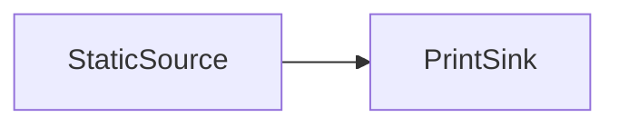
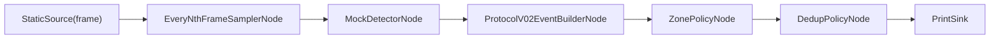
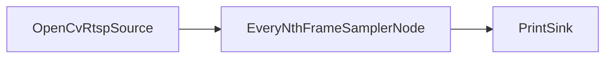
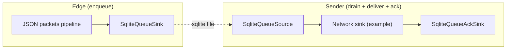

# v2 노드 그래프 가이드 (노드 카탈로그 + 교체 규칙)

Last updated: 2026-02-15

현재 step id (SSOT): `P8.2` (`docs/roadmap/execution_roadmap.md` 참고)

이 문서는 개인 학습/레포 이해를 위한 참고 문서이며 한국어로만 작성했습니다.

## 1) v2 노드 그래프가 뭔가

- v2 그래프는 `nodes`(노드 목록)와 `edges`(연결 목록)로 구성됩니다.
- 노드는 파이썬 플러그인 경로 `module:ClassName`로 로드됩니다.
- 노드 간 데이터 계약은 하나: `StreamPacket` (`src/schnitzel_stream/packet.py`).
- 실행 전 정적 검증을 먼저 합니다.

관련 코드:

- 로더: `src/schnitzel_stream/graph/spec.py`
- DAG 검증: `src/schnitzel_stream/graph/validate.py`
- 호환성 검증: `src/schnitzel_stream/graph/compat.py`
- 플러그인 로딩/정책: `src/schnitzel_stream/plugins/registry.py`
- 런타임: `src/schnitzel_stream/runtime/inproc.py`

## 2) 용어 빠른 정리

### StreamPacket

파일: `src/schnitzel_stream/packet.py`

- `kind`: payload 의미 라벨(예: `frame`, `detection`, `event`, `bytes_ref`)
- `source_id`: 스트림 원본 ID(카메라/센서/로봇 등)
- `payload`: 실제 데이터(딕셔너리/bytes/객체 등)
- `meta`: 운영용 메타(멱등키, durable 큐 seq, frame_idx 등)

핵심 규칙:

- 두 노드가 **packet.kind**와 **payload 형태**에 합의하면 연결 가능합니다.

### 노드 종류(그래프의 kind)

v2 YAML에서 `nodes[].kind`는 다음 중 하나입니다.

- `source`: 입력이 없는 노드. `run() -> Iterable[StreamPacket]` 구현
- `node`: 변환 노드. `process(packet) -> Iterable[StreamPacket]` 구현
- `sink`: 출력 노드. `process(packet)` 구현 + outgoing edge 금지

검증 규칙(정적):

- source는 incoming edge가 있으면 안 됨
- sink는 outgoing edge가 있으면 안 됨

### fan-out / fan-in

- fan-out: 한 노드의 출력이 여러 노드로 퍼지는 형태 (1 -> N)
- fan-in: 여러 노드의 출력이 한 노드로 모이는 형태 (N -> 1)

주의:

- 현재 런타임은 packet을 1개씩 흘려보내는 형태라, fan-in으로 “조인(join)”을 하려면 조인 의미론을 구현한 **상태ful 노드**가 필요합니다.

## 3) 실행 모델(현재 v2 런타임)

런타임: `src/schnitzel_stream/runtime/inproc.py`

- 현재 v2 실행은 **1프로세스/1스레드(in-proc)** 입니다.
- source가 여러 개면 **라운드로빈(round-robin)** 으로 한 packet씩 꺼내서 downstream을 처리합니다.
- 백프레셔(backpressure)를 위해 노드별 inbox 한도를 둘 수 있습니다.

런타임 전용 노드 설정:

- `config.__runtime__`는 **러너 전용 키**입니다.
- 이 값은 플러그인(노드) `config`로 전달되지 않고 런타임에서만 사용됩니다.

예:

- `config.__runtime__.inbox_max`: 노드 inbox 최대 적재 수
- `config.__runtime__.inbox_overflow`: overflow 정책
- overflow 정책: `drop_new`, `drop_oldest`, `error`

## 4) 레인(Portability)과 Durable

실용적으로 2개의 레인이 있다고 보면 됩니다.

### 4.1 in-proc 레인

- 프로세스 내부에서만 의미가 있는 객체(예: OpenCV frame `np.ndarray`)를 그대로 전달할 수 있습니다.
- 빠르지만 프로세스 밖으로 보내기/저장하기/재시작 후 복원 같은 건 자동으로 되지 않습니다.

### 4.2 durable 레인(SQLite queue)

- `SqliteQueue*` 노드를 통해 오프라인 store-and-forward를 구현할 수 있습니다.
- 현재 durable 레인은 **JSON-only** 입니다.
- 즉, `payload`와 `meta`가 JSON 직렬화 가능해야 큐에 들어갑니다.

관련 코드:

- 큐 구현: `src/schnitzel_stream/state/sqlite_queue.py`
- 큐 노드: `src/schnitzel_stream/nodes/durable_sqlite.py`

### 4.3 바이너리/대용량 payload 처리 (bytes_ref)

- durable이 JSON-only이므로, 바이너리를 큐에 넣으려면 “참조(ref)” 형태로 바꿔야 합니다.
- 현재는 로컬 파일 기반(ref scheme `file`)의 최소 구현이 있습니다.

관련 코드:

- `src/schnitzel_stream/nodes/blob_ref.py`

중요 제한:

- `scheme=file`은 **머신 로컬 경로**라서, 다른 컴퓨터로 넘기는 “네트워크 분산”에서는 그대로 쓰기 어렵습니다.
- 분산을 하려면 ref를 `http`/`s3`/objstore URI로 확장하는 것이 일반적입니다(추후 작업).

## 5) v2 그래프 문법(YAML)

로더: `src/schnitzel_stream/graph/spec.py`

최소 형태:

```yaml
version: 2
nodes:
  - id: src
    kind: source
    plugin: schnitzel_stream.nodes.dev:StaticSource
    config:
      packets:
        - kind: demo
          source_id: demo01
          payload: { message: hello }
  - id: out
    kind: sink
    plugin: schnitzel_stream.nodes.dev:PrintSink
    config: { prefix: "OUT " }
edges:
  - from: src
    to: out
config: {}
```

실행:

- 검증: `python -m schnitzel_stream validate --graph <path>`
- 실행: `python -m schnitzel_stream --graph <path>`

플러그인 보안 정책(allowlist):

- 기본적으로 플러그인 로딩은 prefix allowlist를 따릅니다.
- 코드: `src/schnitzel_stream/plugins/registry.py`

## 6) 노드 카탈로그(현재 존재하는 노드)

아래는 현재 `main`에 실제로 있는 노드들입니다.

### 6.1 Dev 노드 (의존성 최소)

파일: `src/schnitzel_stream/nodes/dev.py`

- `schnitzel_stream.nodes.dev:StaticSource`
  - 역할: source
  - kind: `*` 출력
  - 설정: `packets: list[dict]`
- `schnitzel_stream.nodes.dev:Identity`
  - 역할: node
  - kind: `* -> *`
- `schnitzel_stream.nodes.dev:BurstNode`
  - 역할: node
  - kind: `* -> *`
  - 설정: `count`, `meta_key`
  - 용도: 백프레셔/드롭 테스트용 burst 생성
- `schnitzel_stream.nodes.dev:PrintSink`
  - 역할: sink (또는 `forward: true`면 node처럼 downstream으로 전달)
  - kind: `*` 입력
  - 설정: `prefix`, `forward`
  - 의도: dev 편의상 JSON 직렬화 실패를 `default=str`로 회피(프로덕션 sink는 다르게 설계 권장)

### 6.2 Durable(SQLite WAL) 노드 (JSON-only)

파일: `src/schnitzel_stream/nodes/durable_sqlite.py`

- `schnitzel_stream.nodes.durable_sqlite:SqliteQueueSink`
  - 역할: sink
  - 입력 kind: `*`
  - 요구: JSON 직렬화 가능 payload/meta
  - 설정: `path`, `forward`, `meta_key`
- `schnitzel_stream.nodes.durable_sqlite:SqliteQueueSource`
  - 역할: source
  - 출력 kind: `*`
  - 설정: `path`, `limit`, `delete_on_emit`, `meta_key`
- `schnitzel_stream.nodes.durable_sqlite:SqliteQueueAckSink`
  - 역할: sink
  - 입력 kind: `*`
  - 설정: `path`, `meta_key`, `forward`

큐 구현(내부): `src/schnitzel_stream/state/sqlite_queue.py`

- WAL 모드 + FULL synchronous (기본값은 안정성 우선)
- idempotency key unique index로 중복 enqueue를 막는 구조

### 6.3 바이너리 참조 노드 (file scheme)

파일: `src/schnitzel_stream/nodes/blob_ref.py`

- `schnitzel_stream.nodes.blob_ref:BytesToFileRefNode`
  - `bytes -> bytes_ref`
  - 설정: `dir`, `filename`, `compute_sha256`, `content_type`
- `schnitzel_stream.nodes.blob_ref:FileRefToBytesNode`
  - `bytes_ref -> bytes`
  - 설정: `output_kind`

### 6.4 Vision pack 노드 (도메인 전용)

export: `src/schnitzel_stream/packs/vision/nodes/__init__.py`

- `schnitzel_stream.packs.vision.nodes:OpenCvVideoFileSource`
  - 역할: source
  - 출력 kind: `frame`
  - payload: `np.ndarray` 포함(in-proc 전용)
- `schnitzel_stream.packs.vision.nodes:OpenCvRtspSource`
  - 역할: source
  - 출력 kind: `frame`
  - 특징: reconnect + backoff
- `schnitzel_stream.packs.vision.nodes:EveryNthFrameSamplerNode`
  - `frame -> frame`
- `schnitzel_stream.packs.vision.nodes:MockDetectorNode`
  - `frame -> detection`
- `schnitzel_stream.packs.vision.nodes:ProtocolV02EventBuilderNode`
  - `detection -> event`
  - 특징: deterministic `event_id` + `meta.idempotency_key`
- `schnitzel_stream.packs.vision.nodes:ZonePolicyNode`
  - `event -> event` (zone attach)
- `schnitzel_stream.packs.vision.nodes:DedupPolicyNode`
  - `event -> event` (cooldown dedup)

호환 shim(옛 import 경로)도 존재합니다:

- `src/schnitzel_stream/nodes/video.py` 등은 vision pack을 re-export만 합니다.

## 7) E2E 그래프 연결 패턴(레시피)

### 7.1 최소 데모(하드웨어 없음)

그래프: `configs/graphs/dev_inproc_demo_v2.yaml`



### 7.2 Vision E2E(mock) to stdout

그래프: `configs/graphs/dev_vision_e2e_mock_v2.yaml`



### 7.3 RTSP 프레임 to stdout

그래프: `configs/graphs/dev_rtsp_frames_v2.yaml`



### 7.4 오프라인 저장/전송(store-and-forward)

그래프:

- enqueue: `configs/graphs/dev_durable_enqueue_v2.yaml`
- drain: `configs/graphs/dev_durable_drain_v2.yaml`
- drain+ack: `configs/graphs/dev_durable_drain_ack_v2.yaml`



## 8) 교체 규칙(노드 하나를 바꿀 때 어디까지 영향?)

노드 교체 영향을 판단할 때는 아래 4 레이어로 보면 헷갈림이 줄어듭니다.

- 연결 레이어: DAG 구조, source/node/sink 방향 규칙
- kind 레이어: `INPUT_KINDS`/`OUTPUT_KINDS` 호환
- payload 레이어: payload 내부 스키마(키/타입) 호환(현재는 완전 자동 검증이 아님)
- 레인 레이어: in-proc vs durable(JSON-only)

### A) 소스만 교체(출력 kind 동일)

예:

- `OpenCvVideoFileSource` -> `OpenCvRtspSource`
- 둘 다 `kind=frame`

결과:

- downstream이 `frame`만 기대하면 대부분 수정 없이 유지됩니다.
- 바뀌는 것은 소스의 `config`(path/url/reconnect 파라미터) 정도입니다.

### B) 변환 노드 교체(출력 kind + payload 형태 동일)

예:

- `MockDetectorNode` -> (미래) `RealDetectorNode`
- 둘 다 `kind=detection` + detection dict 필드가 동일

결과:

- `ProtocolV02EventBuilderNode`가 그대로 재사용될 가능성이 큽니다.

### C) 출력 kind가 바뀌는 교체

예:

- 비전 파이프(`frame -> ... -> event`)를 오디오 파이프(`audio_chunk -> ... -> event`)로 교체

결과:

- kind 경계 이전은 대부분 바뀝니다.
- `event(JSON)` 같은 “표준화된 중간표현”으로 모이면, 뒤쪽(큐/라우팅/싱크)은 유지하기 쉬워집니다.

### D) durable로 보낼 때

- `SqliteQueue*`를 통과하는 packet은 JSON-only여야 합니다.
- 프레임/바이너리는 먼저 참조로 바꿔서 보냅니다.

## 9) 노드 구현 형태(스켈레톤)

```python
from typing import Any, Iterable
from schnitzel_stream.packet import StreamPacket

class MyNode:
    INPUT_KINDS = {"event"}   # 또는 {"*"}
    OUTPUT_KINDS = {"event"} # 또는 {"*"}

    def __init__(self, *, node_id: str | None = None, config: dict[str, Any] | None = None) -> None:
        self.node_id = str(node_id or "my_node")
        self.cfg = dict(config or {})

    def process(self, packet: StreamPacket) -> Iterable[StreamPacket]:
        return []  # drop

    def close(self) -> None:
        return
```

Source 노드는 `process` 대신 `run()`을 구현합니다.

## 10) 실행 전 체크리스트

- 그래프 검증: `python -m schnitzel_stream validate --graph <path>`
- 최소 문법 체크: `python3 -m compileall -q src tests`
- 전체 테스트(의존성 설치 후):
  - `pip install -r requirements-dev.txt`
  - `PYTHONPATH=src PYTEST_DISABLE_PLUGIN_AUTOLOAD=1 pytest -q`
