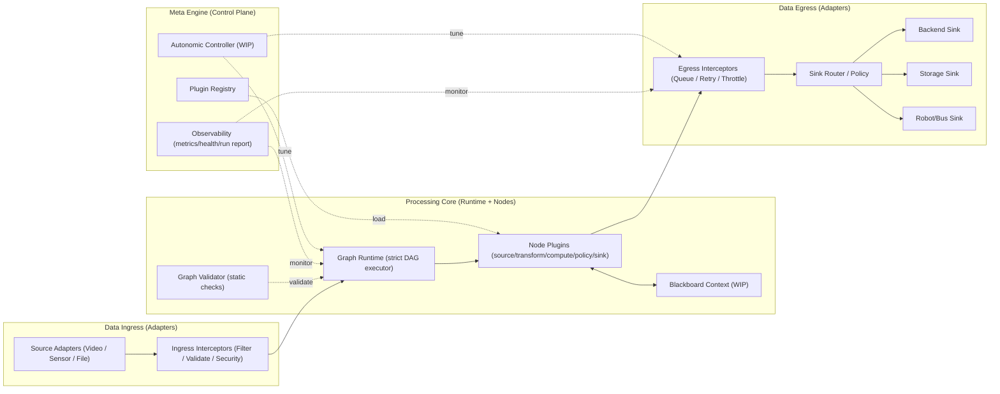
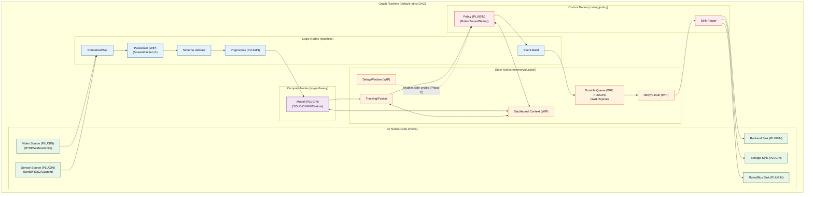

# Strategic Roadmap: schnitzel-stream-platform

Last updated: 2026-02-15

## English

This document is the strategic roadmap for evolving `schnitzel-stream-platform` from a CCTV/video-oriented pipeline into a **lightweight universal stream platform** that can process heterogeneous inputs.

Guiding approach:

- Aim high.
- Describe the current state based on facts.
- Define explicit DoD (Definition of Done) per phase.

---

### 1) North Star

The end state must satisfy all of the following:

1. **Generality**: handle heterogeneous streams (Video, Sensor, Audio, Robot telemetry) under a shared contract
2. **Lightweight**: small runtime footprint that runs on a single edge node
3. **Resilience**: minimize data loss and recover automatically under network/backend failures
4. **Scalability**: same runtime from a single edge to distributed cloud and P2P mesh

---

### 2) Design Principles (Non-negotiables)

1. Separate **Data Plane** from **Control Plane**
2. Make plugin boundaries explicit (default: `source`, `transform`, `compute(model)`, `policy`, `sink`; optionally split `state_backend` / `transport`)
3. Prefer **static validation first** (type/port/cycle checks before execution)
4. Make delivery semantics explicit (default strategy: `at-least-once + idempotency`)
5. Observability is built-in (metrics, logs, health, replayability)

---

### 3) Target Architecture

Consistency rules:

1. The top-level architecture only expresses responsibility boundaries (Ingress/Core/Egress/Meta).
2. Section `3.1)` expands the above into a Node Set DAG view.
3. Control Plane must not execute Data Plane directly; it only injects signals via observation/policy.

---

### 3.1) Node Set Detail (IO / Logic / State / Compute / Control)

The diagram below expands the platform into execution units (node sets).

- **IO**: source/sink boundaries (side-effects)
- **Logic**: stateless transforms (validate/normalize/preprocess)
- **Compute**: heavy computation (model inference)
- **State**: memory/durable state (queue/delay/blackboard)
- **Control**: routing/policy/fusion decisions

Legend:

- `(PLUGIN)` marks a replacement/extension boundary.
  - Default plugin kinds: `source / transform / compute(model) / policy / sink`
  - Provisional: promote `state_backend` (durable queue/blackboard) or `transport` into plugin boundaries if needed.
- `(WIP)` marks a target-architecture component that is not fully implemented yet.

Node set design rules:

1. After `Packetizer`, nodes should communicate only via `StreamPacket`.
2. Prefer pure/stateless transforms; shared state is allowed only behind explicit State boundaries (blackboard/queue).
3. External failures are absorbed via durable delivery (`Durable Queue` + retry/circuit), not by business logic nodes.

Node implementation categories (provisional):

1. **IO Node**: Camera, Sensor, Network, File (data movement, side-effect)
2. **Logic Node**: Filter, Map, Resize, Convert (stateless)
3. **State Node**: Buffer, Delay, Window, Aggregate (stateful)
4. **Compute Node**: AI Model, Heavy math (async)
5. **Control Node**: Switch, Router, Duplicator (flow control)

---

### 4) Reality Baseline (Fact-Based)

Current state by area:

| Area | Scope | Implementation today | Status |
| :--- | :--- | :--- | :--- |
| Async processing | v1 legacy | Non-blocking processing for live sources via a `FrameProcessor` worker thread | Implemented |
| Multi-sensor lane | v1 legacy | Async collection + time-window nearest matching (`MultiSensorRuntime`) | Implemented |
| RTSP recovery | v1 legacy | reconnect + backoff logic | Implemented |
| Output lanes | v1 legacy | backend / jsonl / stdout / custom emitter selection | Implemented |
| Durable persistence | v2 platform | local durable queue building blocks (SQLite/WAL) + demo graphs/tests | MVP implemented |
| Universal packet | v2 platform | `StreamPacket` contract + core type + v2 runtime uses it | MVP implemented (full adoption is ongoing) |
| Graph runtime | v2 platform | v2 in-proc strict DAG runtime + static validation (topology/compat) | MVP implemented |
| Observability | v2 platform | JSON run report + metric naming contract | MVP implemented |
| Autonomic control | v2 platform | policy-driven throttle hooks exist; full control loop is not implemented | Partially implemented |

Notes:

- Sensor fusion today is **time-window nearest matching**, not interpolation.
- Durable delivery exists as building blocks/demos; end-to-end integration across all lanes is still evolving.

---

### 5) Evolution Phases

#### Phase A: Robust Runtime (Completed Baseline)

Key goals:

- non-blocking live input processing
- multi-sensor concurrent collection
- RTSP reconnect
- output lane branching

DoD (already satisfied as a baseline, mostly via legacy runtime):

- inference does not block the main loop for live sources
- partial sensor failures do not stop the camera loop
- automatic retry after RTSP disconnect

#### Phase B: Universal Packet Contract (In Progress)

Key goals:

- domain-neutral `StreamPacket` as the universal contract
- bidirectional translation layer to/from legacy event schema
- standardize node-to-node data exchange
- (provisional) unified hot-path mutation interface for safe topology changes

DoD:

1. `StreamPacket v1` contract is defined and stabilized (`docs/contracts/stream_packet.md`)
2. video/sensor inputs can be represented as packets
3. compatibility adapters exist for legacy event schema

#### Phase C: Graph Runtime + Plugin Platform (MVP Done, Continue Hardening)

Key goals:

- YAML/JSON graph DSL
- static validator (cycle/type/port/required-field/transport-compat)
- transport compatibility rules (prevent unsafe mixing: shared-memory vs network)
- plugin loading and compatibility policy
- limited hot-reload (near zero-downtime node replacement)
- (provisional) policy-driven dynamic graph mutation (insert/remove/replace)

DoD:

1. DAG executor MVP
2. fail-closed on validation failure (no execution)
3. plugin API semver policy documented
4. demo: replace a policy node without a full process restart (gated)

#### Phase D: Durable Delivery Hardening (MVP Done, Continue Hardening)

Key goals:

- local durable queue (SQLite or WAL JSONL)
- store-and-forward under network disconnect
- safe duplicate handling via idempotency keys

DoD:

1. long outage tests meet the event loss threshold
2. backlog replay after restart is automatic
3. failure scenarios are automated as tests

#### Phase E: Autonomic Control Plane + Internal Feedback Loops (Stretch)

Key goals:

- metric-driven policy tuning (FPS, resolution, batch size)
- environment-aware mode switching (low-power/low-bandwidth)
- operator override for control loops
- (stretch) internal feedback loop support (cyclic graphs)
  - allow safe cycles via `DelayNode` and `InitialValue`
  - enable observer/actuator patterns and control-theory loops (PID)
- (stretch/TBD) LLM-driven graph compilation and self-coding nodes (human-in-the-loop)

DoD:

1. guardrails (bounds, cooldowns, rollback)
2. traceability: log why a tuning decision happened
3. reproducible improvement vs a manual policy baseline

---

### 6) Tech Debt Priorities

#### High

1. Define a portable payload boundary for `StreamPacket` (in-proc objects vs handles/encodings for IPC/network).
2. Runtime execution semantics beyond simple topological order (push/pull, backpressure, batching, cancellation).
3. Plugin distribution/versioning/security policy (semver, registry, compatibility checks).
4. Stateful node model and failure semantics (durable queue/blackboard/delay across restarts).

#### Medium

1. RTSP + multi-sensor parity in v2 graphs (if required for the Phase 4 parity scope).
2. Hot-reload and dynamic graph mutation (gated by safety and operational needs).
3. Cycle-capable execution semantics (beyond a validator-only policy).

#### Low

1. Doc naming consolidation and removing legacy wording where it confuses the platform direction.
2. Reproducible edge benchmark/failure injection kit.

---

### 7) Success Metrics

These are aspirational targets. Each phase completion should include validation to confirm realistic numbers.

1. **Availability**: single edge runtime session availability 99.9%+
2. **Recovery**: resume normal delivery within 15s after RTSP/backend recovery
3. **Data safety**: < 0.01% loss under fault injection tests
4. **Portability**: same graphs reproducible on Linux/Windows/macOS + edge targets
5. **Extensibility**: new plugins deployable without core changes

---

### 8) Strategic Value

This project is not "video inference code".

The core value is a **lightweight universal stream execution engine**:

- stream processing core reusable across domains
- operational automation that adapts to changing edge conditions
- faster iteration via a plugin ecosystem

In short: the goal is not feature shipping; it is **platformization**.

Meta:

- Project owner: Kyungho Cha
- Brand: Schnitzel

---

## 한국어

본 문서는 `schnitzel-stream-platform`을 영상 특화 파이프라인에서 멈추지 않고, 다양한 입력 타입을 처리할 수 있는 **경량 범용 스트림 플랫폼**으로 진화시키기 위한 전략 문서다.

핵심 방향은 단순하다.

- 목표는 크게 잡는다.
- 현재 구현 상태는 사실 기반으로 적는다.
- 단계별 종료 조건(DoD)을 명확히 둔다.

---

### 1) North Star

`schnitzel-stream-platform`의 최종 목표는 아래 4가지를 동시에 만족하는 것이다.

1. **범용성**: Video, Sensor, Audio, Robot telemetry 등 이기종 스트림을 동일 계약으로 처리
2. **경량성**: 엣지 단일 노드에서도 동작하는 작은 런타임 풋프린트
3. **회복탄력성**: 네트워크/백엔드 장애 시에도 데이터 손실 최소화와 자동 복구
4. **확장성(Scalability)**: 단일 엣지부터 클라우드 분산, P2P Mesh Network까지 동일 런타임 지원

---

### 2) 설계 원칙 (Non-negotiables)

1. **Data Plane / Control Plane 분리**
2. **플러그인 경계 명확화** (기본: `source`, `transform`, `compute(model)`, `policy`, `sink`; 필요 시 `state_backend`/`transport`로 분리)
3. **정적 검증 우선** (그래프 실행 전 타입/포트/사이클 검증)
4. **전송 의미론 명시** (`at-least-once + idempotency`를 기본 전략으로)
5. **관측 가능성 내장** (metrics, logs, health, replayability)

---

### 3) 목표 아키텍처 (Target Architecture)

정합성 규칙:

1. 상위 아키텍처는 책임 분리(Ingress/Core/Egress/Meta)만 표현한다.
2. `3.1)` 섹션은 상위 Ingress/Core/Egress를 Node Set DAG 관점으로 펼친 상세도다.
3. Control Plane은 Data Plane을 직접 실행하지 않고, 관측/정책 신호만 주입한다.

---

### 3.1) 노드 집합 상세 (IO / Logic / State / Compute / Control)

아래 다이어그램은 상위 아키텍처를 실제 실행 단위(Node Set)로 풀어낸 것이다.

- **IO**: 소스/싱크 경계 (Side-effect O)
- **Logic**: 검증/정규화/전처리 등 Stateless 변환
- **Compute**: 모델 추론 등 고비용 연산 (비동기/가속 고려)
- **State**: blackboard/queue/delay 등 상태 경계 (메모리/내구성)
- **Control**: 정책/라우팅 등 데이터 흐름 제어

표기:

- 노드명에 `(PLUGIN)`이 붙은 지점이 교체 가능한 확장 경계다.
  - 기본 범위: `source / transform / compute(model) / policy / sink`
  - Provisional: 필요 시 `state_backend`(durable queue/blackboard)나 `transport`도 플러그인 경계로 승격한다.
- 노드명에 `(WIP)`가 붙은 지점은 목표 아키텍처 기준 미완성/미구현 항목이다.

노드 집합 설계 규칙:

1. `Packetizer` 이후에는 노드 간 통신을 `StreamPacket`으로 표준화한다.
2. 처리 노드는 순수/무상태 변환을 우선하고, 상태 공유는 명시적 State 경계(blackboard/queue) 뒤에서만 허용한다.
3. 외부 장애는 durable delivery 계층(`Durable Queue` + retry/circuit)에서 흡수하고, 비즈니스 로직 노드는 단순하게 유지한다.

노드 구현 분류(Legend, provisional):

1. **IO Node**: Camera, Sensor, Network, File (순수 데이터 이동, Side-effect O)
2. **Logic Node**: Filter, Map, Resize, Convert (Stateless, 즉시 실행, Side-effect X)
3. **State Node**: Buffer, Delay, Window, Aggregate (Stateful, 이전 데이터 기억)
4. **Compute Node**: AI Model, Heavy Math (Async 실행, 별도 스레드/프로세스)
5. **Control Node**: Switch, Router, Duplicator (데이터 흐름 제어, 분기/병합)

---

### 4) 현재 상태 (Reality Baseline)

아래는 현재 코드 기준 사실 상태다.

| 영역 | 스코프 | 현재 구현 | 상태 |
| :--- | :--- | :--- | :--- |
| 비동기 처리 | v1 legacy | 라이브 소스에서 `FrameProcessor` 워커 스레드 기반 비차단 처리 | 구현됨 |
| 멀티 센서 | v1 legacy | `MultiSensorRuntime` 기반 비동기 수집 및 시간창 근접 매칭 | 구현됨 |
| RTSP 회복 | v1 legacy | 재연결 + 백오프 로직 | 구현됨 |
| 출력 경로 | v1 legacy | backend / jsonl / stdout / custom emitter 선택 | 구현됨 |
| 내구성 저장 | v2 platform | 로컬 영구 큐(SQLite/WAL) 기반 store-and-forward 빌딩블록 + 데모/테스트 | MVP 구현됨 |
| 범용 패킷 | v2 platform | `StreamPacket` 계약 문서 + 코어 타입 + v2 런타임 사용 | MVP 구현됨 (전면 적용은 진행중) |
| 그래프 실행기 | v2 platform | v2 in-proc strict DAG 런타임 + 정적 검증(토폴로지/호환성) | MVP 구현됨 |
| 관측 가능성 | v2 platform | JSON 실행 리포트 + 메트릭 네이밍 계약 | MVP 구현됨 |
| 자율 제어 | v2 platform | 정책 기반 throttle hook은 존재, control loop는 미구현 | 부분 구현됨 |

주의:

- 현재 센서 결합은 “Interpolation 완료”가 아니라 **time-window 내 nearest 매칭**이다.
- durable delivery는 빌딩블록/데모 형태로 존재하며, 모든 경로에 end-to-end로 적용되는 단계는 아직 발전 중이다.

---

### 5) Evolution Phases

#### Phase A: Robust Runtime (Completed Baseline)

핵심 목표:

- 라이브 입력 비차단 처리
- 멀티센서 병행 수집
- RTSP 재연결
- 출력 경로 분기

완료 조건(베이스라인으로 이미 충족, 주로 레거시 런타임 기반):

- 라이브 소스에서 추론이 메인 루프를 블로킹하지 않음
- 센서 일부 실패가 카메라 루프를 중단시키지 않음
- RTSP 단절 후 자동 재시도 동작

#### Phase B: Universal Packet Contract (In Progress)

핵심 목표:

- 도메인 중립 `StreamPacket` 도입
- 기존 이벤트 스키마와 양방향 변환 계층 추가
- 노드 간 데이터 교환 계약 표준화
- (Provisional) 실시간 토폴로지 변경을 위한 데이터 인터페이스 단일화 (Hot-Path Mutation)

종료 조건(DoD):

1. `StreamPacket v1` 스키마 확정 (header/payload/meta) — `docs/contracts/stream_packet.md`
2. video/sensor 입력 모두 Packet으로 표현 가능
3. 기존 이벤트 스키마와 호환 변환기 제공

#### Phase C: Graph Runtime + Plugin Platform (MVP Done, Continue Hardening)

핵심 목표:

- YAML/JSON 기반 그래프 DSL
- 정적 검증기 (cycle/type/port/required-field/transport-compatibility)
- 노드 간 통신 프로토콜 검증 (SharedMemory vs Network 혼용 차단)
- 플러그인 로딩과 버전 호환 정책
- 무중단에 가까운 노드 교체(제한적 hot-reload)
- (Provisional) LLM/Policy 기반 동적 그래프 구조 변형(Insert/Remove/Replace) 지원

종료 조건(DoD):

1. DAG 실행기 MVP
2. 그래프 검증 실패 시 실행 차단
3. 플러그인 API semver 정책 문서화
4. 1회 재시작 없는 정책 노드 교체 데모(안전/운영 필요성으로 게이트)

#### Phase D: Durable Delivery Hardening (MVP Done, Continue Hardening)

핵심 목표:

- 로컬 영구 큐(SQLite or WAL JSONL) 도입
- 네트워크 단절 시 store-and-forward 보장
- idempotency key 기반 중복 안전 전송

종료 조건(DoD):

1. backend outage 장시간 테스트에서 이벤트 손실률 기준 충족
2. 재기동 후 미전송 backlog 자동 재송신
3. 장애 시나리오 테스트 자동화

#### Phase E: Autonomic Control Plane + Internal Feedback Loops (Stretch)

핵심 목표:

- 지표 기반 정책 자동 튜닝(FPS, 해상도, 배치 크기)
- 환경 인지형 미들웨어 선택(저전력/저대역폭 모드)
- 운영자 override 가능한 제어 루프
- (Stretch) 내부 피드백 루프 지원(Cyclic Graph)
  - `DelayNode` 및 `InitialValue` 설정을 통한 안전한 루프 실행 보장
  - 옵저버/액추에이터 패턴, 제어 이론(PID) 루프 구현 가능
- (Stretch/TBD) LLM 기반 그래프 컴파일/자기 생성 노드(사용자 승인 기반)

종료 조건(DoD):

1. 안전 가드레일(상한/하한, 쿨다운, 롤백) 구현
2. 자동 튜닝 적용/해제 로그와 근거 추적 가능
3. 수동 정책 대비 개선 지표 재현

---

### 6) 기술 부채 우선순위

#### High

1. `StreamPacket`의 이식 가능한 payload 경계 정의(in-proc 객체 vs IPC/Network용 핸들/인코딩).
2. 단순 topological order를 넘는 런타임 실행 의미론(push/pull, backpressure, batching, cancel).
3. 플러그인 배포/버전/보안 정책(semver, registry, 호환성 체크).
4. 상태 노드의 실패/복구 모델(durable queue/blackboard/delay의 재시작 의미론).

#### Medium

1. Phase 4 패리티 범위에 필요하다면 v2에서 RTSP/멀티센서 패리티 확보.
2. hot-reload 및 동적 그래프 변형(안전/운영 필요성 기준으로 게이트).
3. validator-only를 넘어서는 cycle 실행 의미론(루프 스케줄링/수렴/가드레일).

#### Low

1. 플랫폼 방향을 흐리는 레거시 네이밍/문서 정리.
2. 재현 가능한 엣지 벤치/장애 주입 테스트 킷.

---

### 7) 성공 지표 (Success Metrics)

아래 수치는 “높은 목표”이며, 각 Phase 완료 시 검증으로 확정한다.

1. **Availability**: 단일 엣지 런타임 세션 가동률 99.9%+
2. **Recovery**: RTSP/Backend 복구 후 정상 전송 재개까지 15초 이하
3. **Data Safety**: 장애 주입 테스트에서 유실률 0.01% 이하
4. **Portability**: Linux/Windows/macOS + edge target에서 동일 그래프 실행 재현
5. **Extensibility**: 신규 플러그인 추가 시 코어 수정 없이 배포 가능

---

### 8) 전략적 가치

이 프로젝트의 본질은 “영상 추론 코드”가 아니다.

**핵심 가치는 경량 범용 스트림 실행 엔진**이다:

- 어떤 도메인에서도 재사용 가능한 스트림 처리 코어
- 환경 변화에 적응하는 운영 자동화 기반
- 플러그인 생태계를 통한 확장 속도

즉, 목표는 단순 기능 개발이 아니라 **플랫폼화**다.

Meta:

- Project owner: Kyungho Cha
- Brand: Schnitzel
