# Strategic Roadmap: schnitzel-stream-platform

본 문서는 `schnitzel-stream-platform`을 영상 특화 파이프라인에서 멈추지 않고, 다양한 입력 타입을 처리할 수 있는 **경량 범용 스트림 플랫폼**으로 진화시키기 위한 전략 문서다.

핵심 방향은 단순하다.

- 목표는 크게 잡는다.
- 현재 구현 상태는 사실 기반으로 적는다.
- 단계별 종료 조건(DoD)을 명확히 둔다.

---

## 1) North Star

`schnitzel-stream-platform`의 최종 목표는 아래 3가지를 동시에 만족하는 것이다.

1. **범용성**: Video, Sensor, Audio, Robot telemetry 등 이기종 스트림을 동일 계약으로 처리
2. **경량성**: 엣지 단일 노드에서도 동작하는 작은 런타임 풋프린트
3. **회복탄력성**: 네트워크/백엔드 장애 시에도 데이터 손실 최소화와 자동 복구
4. **확장성(Scalability)**: 단일 엣지부터 클라우드 분산, P2P Mesh Network까지 동일 런타임 지원

---

## 2) 설계 원칙 (Non-negotiables)

1. **Data Plane / Control Plane 분리**
2. **플러그인 경계 명확화** (기본: `source`, `transform`, `compute(model)`, `policy`, `sink`; 필요 시 `state_backend`/`transport`로 분리)
3. **정적 검증 우선** (그래프 실행 전 타입/포트/사이클 검증)
4. **전송 의미론 명시** (`at-least-once + idempotency`를 기본 전략으로)
5. **관측 가능성 내장** (metrics, logs, health, replayability)

---

## 3) 목표 아키텍처 (Target Architecture)

```mermaid
graph LR
    subgraph Ingress ["Data Ingress (Adapters)"]
        S["Source Adapters (Video / Sensor / File)"]
        I["Ingress Interceptors (Filter / Validate / Security)"]
    end

    subgraph Core ["Processing Core (Nodes)"]
        G["Graph Runtime (DAG Executor) 🚧"]
        P["Inference & Transform Nodes"]
        B[(Blackboard Context 🚧🧩)]
        L["Decision Logic Nodes (Rules / Fusion)"]
    end

    subgraph Egress ["Data Egress (Adapters)"]
        O["Egress Interceptors (Queue / Retry / Throttle) 🚧"]
        R["Sink Router"]
        D1["Backend Sink"]
        D2["Storage Sink"]
        D3["Robot/Bus Sink"]
    end

    subgraph Meta ["Meta Engine (Control Plane)"]
        M0["Plugin Registry 🧩"]
        M1["Graph Validator 🚧"]
        M2["Observability Metrics"]
        M3["Autonomic Controller 🚧"]
    end

    S --> I
    I --> G
    G --> P
    P <--> B
    B --> L
    L --> O
    O --> R
    R --> D1
    R --> D2
    R --> D3

    M0 -. load .-> G
    M1 -. validate .-> G
    M2 -. monitor .-> G
    M2 -. monitor .-> O
    M3 -. optimize .-> G
    M3 -. optimize .-> O
```

정합성 규칙:

1. 상위 아키텍처는 책임 분리(Ingress/Core/Egress/Meta)만 표현한다.
2. `3.1)` 섹션은 상위 Ingress/Core/Egress를 Node Set DAG 관점으로 펼친 상세도다.
3. Control Plane은 Data Plane을 직접 실행하지 않고, 관측/정책 신호만 주입한다.

---

## 3.1) 노드 집합 상세 (IO / Logic / State / Compute / Control)

아래 다이어그램은 상위 아키텍처를 실제 실행 단위(Node Set)로 풀어낸 것이다.

- **IO**: 소스/싱크 경계 (Side-effect O)
- **Logic**: 검증/정규화/전처리 등 Stateless 변환
- **Compute**: 모델 추론 등 고비용 연산 (비동기/가속 고려)
- **State**: blackboard/queue/delay 등 상태 경계 (메모리/내구성)
- **Control**: 정책/라우팅 등 데이터 흐름 제어

```mermaid
flowchart LR
    classDef io fill:#e8f5e9,stroke:#1b5e20,stroke-width:1px,color:#111
    classDef logic fill:#e3f2fd,stroke:#0d47a1,stroke-width:1px,color:#111
    classDef compute fill:#f3e5f5,stroke:#4a148c,stroke-width:1px,color:#111
    classDef state fill:#fff3e0,stroke:#e65100,stroke-width:1px,color:#111
    classDef control fill:#ffebee,stroke:#b71c1c,stroke-width:1px,color:#111

    subgraph DAG["Graph Runtime (default: strict DAG) 🚧"]
        direction LR

        subgraph IO["IO Nodes (side-effects)"]
            direction TB
            I1["Video Source 🧩<br/>(RTSP/Webcam/File)"]:::io
            I2["Sensor Source 🧩<br/>(Serial/ROS2/Custom)"]:::io
            O4["Backend Sink 🧩"]:::io
            O5["Storage Sink 🧩"]:::io
            O6["Robot/Bus Sink 🧩"]:::io
        end

        subgraph LOGIC["Logic Nodes (stateless)"]
            direction TB
            N1["Normalize/Map"]:::logic
            PK["Packetizer 🚧🧩<br/>(StreamPacket v1)"]:::logic
            V1["Schema Validate"]:::logic
            P2["Preprocess 🧩"]:::logic
            EB["Event Build"]:::logic
        end

        subgraph COMPUTE["Compute Nodes (async/heavy)"]
            direction TB
            P3["Model 🧩<br/>(YOLO/ONNX/Custom)"]:::compute
        end

        subgraph STATE["State Nodes (memory/durable)"]
            direction TB
            P4["Tracking/Fusion"]:::state
            B[(Blackboard Context 🚧🧩)]:::state
            DLY["Delay/Window 🚧"]:::state
            O1["Durable Queue 🚧🧩<br/>(WAL/SQLite)"]:::state
            O2["Retry/Circuit 🚧"]:::state
        end

        subgraph CTRL["Control Nodes (routing/policy)"]
            direction TB
            P5["Policy 🧩<br/>(Rules/Zones/Dedup)"]:::control
            O3["Sink Router"]:::control
        end

        I1 --> N1
        I2 --> N1
        N1 --> PK --> V1 --> P2 --> P3 --> P4 --> P5 --> EB --> O1 --> O2 --> O3
        O3 --> O4
        O3 --> O5
        O3 --> O6

        P3 <--> B
        P4 <--> B
        P5 <--> B

        DLY -. enables safe cycles (Phase E) .-> P5
    end
```

플러그인 표기:

- 노드명에 `🧩`가 붙은 지점이 교체 가능한 확장 경계다.
- 기본 범위: `source / transform / compute(model) / policy / sink`
- Provisional: 필요 시 `state_backend`(durable queue/blackboard)나 `transport`도 플러그인 경계로 승격한다.

미구현 표기:

- 노드명에 `🚧`가 붙은 지점은 목표 아키텍처 기준 미구현 항목이다.

노드 집합 설계 규칙:

1. 입력 노드는 원본 포맷을 직접 처리하되, `Packetizer` 이후에는 `StreamPacket`만 사용
2. 처리 노드는 순수 함수형 변환을 우선하고, 상태 공유는 `Blackboard` 경계에서만 허용
3. 출력 노드는 항상 `Durable Queue`를 경유하고, 외부 장애는 `Retry/Circuit`에서 흡수

**Node Implementation Categories (Legend, provisional):**
1. **IO Node**: Camera, Sensor, Network, File (순수 데이터 이동, Side-effect O)
2. **Logic Node**: Filter, Map, Resize, Convert (Stateless, 즉시 실행, Side-effect X)
3. **State Node**: Buffer, Delay, Window, Aggregate (Stateful, 이전 데이터 기억)
4. **Compute Node**: AI Model, Heavy Math (Async 실행, 별도 스레드/프로세스)
5. **Control Node**: Switch, Router, Duplicator (데이터 흐름 제어, 분기/병합)

DAG 적용 범위:

1. **실행 단위**: `Graph Runtime` 내부의 전체 노드 그래프
2. **그래프 계층**: Node Set 간 연결 + Set 내부 연결을 하나의 DAG로 취급
3. **검증 단위**: cycle/type/port 검증은 DAG 전체에 적용

---

## 4) 현재 상태 (Reality Baseline)

아래는 현재 코드 기준 사실 상태다.

| 영역 | 현재 구현 | 상태 |
| :--- | :--- | :--- |
| 비동기 처리 | 라이브 소스에서 `FrameProcessor` 워커 스레드 기반 비차단 처리 | 구현됨 |
| 멀티 센서 | `MultiSensorRuntime` 기반 비동기 수집 및 시간창 근접 매칭 | 구현됨 |
| RTSP 회복 | 재연결 + 백오프 로직 | 구현됨 |
| 출력 경로 | backend / jsonl / stdout / custom emitter 선택 | 구현됨 |
| 내구성 저장 | 로컬 영구 큐(SQLite/WAL) 기반 store-and-forward | 미구현 |
| 범용 패킷 | `StreamPacket` 통합 계약 | 미구현 |
| 그래프 실행기 | DAG 기반 노드 실행/정적 검증/핫스왑 | 미구현 |
| 자율 제어 | 정책 기반 자동 튜닝 컨트롤 루프 | 미구현 |

주의:

- 현재 센서 결합은 “Interpolation 완료”가 아니라 **time-window 내 nearest 매칭**이다.
- backend 장애 복구는 일부 fallback이 있으나, **완전한 durable delivery 계층**은 아직 없다.

---

## 5) Evolution Phases

### Phase A: Robust Runtime (Completed Baseline)

핵심 목표:

- 라이브 입력 비차단 처리
- 멀티센서 병행 수집
- RTSP 재연결
- 출력 경로 분기

완료 조건(이미 충족):

- 라이브 소스에서 추론이 메인 루프를 블로킹하지 않음
- 센서 일부 실패가 카메라 루프를 중단시키지 않음
- RTSP 단절 후 자동 재시도 동작

### Phase B: Universal Packet Contract (In Progress)

핵심 목표:

- 도메인 중립 `StreamPacket` 도입
- 기존 이벤트 스키마와 양방향 변환 계층 추가
- 노드 간 데이터 교환 계약 표준화
- **[Provisional] 실시간 토폴로지 변경을 위한 데이터 인터페이스 단일화 (Hot-Path Mutation)**

종료 조건(DoD):

1. `StreamPacket v1` 스키마 확정 (header/payload/meta) — `docs/contracts/stream_packet.md`
2. video/sensor 입력 모두 Packet 변환 성공
3. 기존 이벤트 스키마와 호환 변환기 제공

### Phase C: Graph Runtime + Plugin Platform (Target)

핵심 목표:

- YAML/JSON 기반 그래프 DSL
- 정적 검증기 (cycle/type/port/required-field/transport-compatibility)
- 노드 간 통신 프로토콜 검증 (SharedMemory vs Network 혼용 차단)
- 플러그인 로딩과 버전 호환 정책
- 무중단에 가까운 노드 교체(제한적 hot-reload)
- **[Provisional] LLM/Policy 기반 동적 그래프 구조 변형(Insert/Remove/Replace) 지원**

종료 조건(DoD):

1. DAG 실행기 MVP
2. 그래프 검증 실패 시 실행 차단
3. 플러그인 API semver 정책 문서화
4. 1회 재시작 없는 정책 노드 교체 데모

### Phase D: Durable Delivery Hardening (Target)

핵심 목표:

- 로컬 영구 큐(SQLite or WAL JSONL) 도입
- 네트워크 단절 시 store-and-forward 보장
- idempotency key 기반 중복 안전 전송

종료 조건(DoD):

1. backend outage 장시간 테스트에서 이벤트 손실률 기준 충족
2. 재기동 후 미전송 backlog 자동 재송신
3. 장애 시나리오 테스트 자동화

### Phase E: Autonomic Control Plane (Stretch)

핵심 목표:

- 지표 기반 정책 자동 튜닝(FPS, 해상도, 배치 크기)
- 환경 인지형 미들웨어 선택(저전력/저대역폭 모드)
- 운영자 override 가능한 제어 루프
- **[Stretch] Internal Feedback Loop Support (Cyclic Graph)**:
    - DAG(비순환) 제약을 해제하고 노드 간 내부 순환 연결 지원
    - `DelayNode` 및 `InitialValue` 설정을 통한 안전한 루프 실행 보장
    - 제어 이론(PID) 및 자기 학습(Self-Correction) 로직 구현 가능
- **[Stretch/TBD] LLM-driven Graph Compilation & Self-Coding Node**:
    - 자연어 의도를 해석하여 그래프 구성 및 노드별 프롬프트(Role) 자동 생성/주입
    - 미구현 기능에 대해 LLM이 즉석에서 코드(Python) 생성 및 핫로딩 (Synthesized Code Injection)
    - **[Provisional] Automated Code Hygiene & Refactoring Agent**:
        - 생성된 코드의 중복성(Redundancy) 분석 및 병합(Merge) 제안
        - 미사용 임시 노드(Transient Node)에 대한 생명주기 관리 및 GC(Garbage Collection) 수행
        - 사용자 승인(Human-in-the-Loop) 기반 코드 베이스 병합(Merge Request)

종료 조건(DoD):

1. 안전 가드레일(상한/하한, 쿨다운, 롤백) 구현
2. 자동 튜닝 적용/해제 로그와 근거 추적 가능
3. 수동 정책 대비 개선 지표 재현

---

## 6) 기술 부채 우선순위

### High

1. Durable persistence 계층 부재 (장애 구간 장기 누적 보호 약함)
2. 도메인 중립 데이터 계약 미정 (`StreamPacket` 없음)
3. 백엔드 전송 의미론의 운영 문서화 부족 (ack/queue/drop 경계)

### Medium

1. 그래프 기반 실행기 부재 (순차 실행 중심)
2. 플러그인 ABI/버전 정책 미정
3. 재현 가능한 성능/장애 벤치셋 부족

### Low

1. 도메인 문서와 범용 플랫폼 문서의 네이밍 혼재
2. 일부 설계 문서의 구현 대비 표현 과장

---

## 7) 성공 지표 (Success Metrics)

아래 수치는 “높은 목표”이며, 각 Phase 완료 시 검증으로 확정한다.

1. **Availability**: 단일 엣지 런타임 세션 가동률 99.9%+
2. **Recovery**: RTSP/Backend 복구 후 정상 전송 재개까지 15초 이하
3. **Data Safety**: 장애 주입 테스트에서 유실률 0.01% 이하
4. **Portability**: Linux/Windows/macOS + edge target에서 동일 그래프 실행 재현
5. **Extensibility**: 신규 플러그인 추가 시 코어 수정 없이 배포 가능

---

## 8) 전략적 가치

이 프로젝트의 본질은 “영상 추론 코드”가 아니다.

**핵심 가치는 경량 범용 스트림 실행 엔진**이다:

- 어떤 도메인에서도 재사용 가능한 스트림 처리 코어
- 환경 변화에 적응하는 운영 자동화 기반
- 플러그인 생태계를 통한 확장 속도

즉, 목표는 단순 기능 개발이 아니라 **플랫폼화**다.

---

**Last Updated**: 2026-02-13  
**Project Owner**: Kyungho Cha  
**Brand**: Schnitzel
